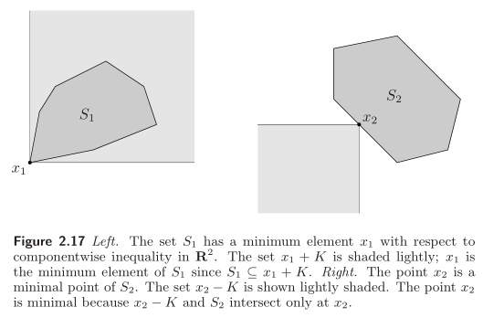

# Notes for "Convex Optimization"
## Chapter 2: Convex Set
### Affine set
__Definition:__  
if $C \in R^n$ is affine set
$$
\theta x_1 + (1-\theta)x_2 \in C\\
x_1, x_2 \in C, \quad \theta \in R
$$

### Affine hull
__Definition:__  
The set of all affine combinations of points in some set $C \in R^n$.  
$$
\mathbf{aff}\quad C = \{\theta_1x_1+...+\theta_kx_k|x_1,...x_k \in C, \theta_1 + ... \theta_k = 1\} 
$$

### Convex set
__Definition:__  
if $C \in R^n$ is convex set
$$
\theta x_1 + (1-\theta)x_2 \in C\\
x_1, x_2 \in C, \quad 0 \leq \theta \leq 1 
$$
The idea of a convex combination can be generalized to include infinite sums.
  

### Convex hull
__Definition:__  
The convex hull of a set $C$ is the set of all convex combinations pf points in $C$.
$$
\mathbf{conv}\quad C = \{\theta_1x_1+...+\theta_kx_k|x_i\in C, \theta_i \geq 0,i=1,...k,\theta_1 + ... \theta_k = 1\} 
$$

### Cones
__Definition:__  
For every $x \in C$ and $\theta \geq 0$, we have $\theta x \in C$.

### Convex Cones
__Definition:__  
For any $x_1, x_2 \in C$ and $\theta_1,\theta_2 \geq 0$, we have
$$
\theta_1 x_1 + \theta_2 x_2 \in C
$$

### Conic hull
__Definition:__  
The conic hull of a set $C$ is the set of all conic combinations of points in $C$.
$$
 \{\theta_1x_1+...+\theta_kx_k|x_i\in C, \theta_i \geq 0,i=1,...k,\} 
$$

###Hyperplanes
__Definition:__  
$$
\{x|a^Tx=b, a \in R^n, a \neq 0\}
$$
This formulation can be expressed as:
$$
\{x|a^T(x-x_0)=0, a \in R^n, a \neq 0\}
$$

###Halfspace
__Definition:__
$$
\{x|a^Tx \leq b, a \in R^n, a \neq 0\}
$$
which can also be expressed as:
$$
\{x|a^T(x-x_0) \leq 0, a \in R^n, a \neq 0\}
$$

###Euclidean balls and ellipsoids
__Definition:__  
A ball in $R^n$ has the form
$$
B(x_c,r) = \{x|\parallel x-x_c \parallel_2 \leq r\} = \{x|(x-x_c)^T(x-x_c) \ leq r^2\}
$$
which can be expressed as:
$$
B(x_c,r) = \{x_c+ru|\parallel u \parallel_2 \leq 1\}
$$
A Euclidean ball is a convex set.

Ellipsoids is a convex set, which have the form
$$
\varepsilon = \{x|(x-x_c)^T P (x-x_c) \leq 1\}
$$
where $P = P^T \succ 0$. It can be also expressed as
$$
\varepsilon = \{x_c+Au|\parallel u \parallel_2 \leq 1\}
$$
$A$ is symmetric and positive definite. $A=P^{1/2}$

### Polyhedra
__Definition:__  
A polyhedra is the solution set of a finite number of linear equalities and ineuqalities.
$$
\mathbf{P}= \{x|a_j^Tx \leq b_j, j=1,...m, c_j^Tx=d_j,j=1,...p \}
$$
Also can be expressed as
$$
\mathbf{P}= \{x|Ax \preceq b, Cx=d\}
$$
where $A$ and $C$ are matrix.  
Polyhedra is a convex set.

__Simplexes:__  
Suppose the points $v_0,...v_k \in R^n$ are affinely independent ($v1_v0,...v_k-v_0$ are linear independent) 
$$
C = \mathbf{conv}\{v_0,...,v_k\}=\{\theta_1x_1+...+\theta_kx_k|\theta \succeq 0, 1^T\theta=0\} 
$$

__Convex hull description of polyhedra__:  
$$
\mathbf{conv}\{v_0,...,v_k\}=\{\theta_1x_1+...+\theta_kx_k|\theta \succeq 0, 1^T\theta=0\} 
$$
The difference between ployhedra and simplexes is that ployhedra doesn't require the affinely independent on the points.  
The difference between ployhedra and convex hull is that convex hull requires the first m coefficients to sum to one.
$$
\mathbf{conv}\{v_0,...,v_k\}=\{\theta_1x_1+...+\theta_kx_k|\theta \succeq 0, \theta_1+...+\theta_m=1\} 
$$
where $m \leq k$.

### Positive semidefinite Cone
$\mathbf{S}^n$ is used to denote the set of symmetric $n \times n$ matrices.  
The positive semidefinite matrices:
$$
\mathbf{S}^n_+=\{X \in \mathbf{S}^n|X \succ 0\}
$$

### Operations that preserve convexity
__Intersection__  
If $S_1$ and $S_2$ are convex, then $S_1 \cup S_2$ is convex.

__Linear-fractional and perspective function__  

### Generalized inequalities
__Proper cones__  
A cone $K \subseteq R^n$ is called a proper cone if:
1. $K$ is convex.
2. $K$ is closed.
3. $K$ has nonempty interior
4. $K$ is point (it contains no line)

__Generalized inequality Definition__  
$$
x \preceq_K y \Leftrightarrow y-x \in K
$$
When the symbol appears between vectors, it means:
$$
x \preceq_K y \\
x_i < y_i, i = 1,...,n
$$
When the symbol appears between matrices, it means:
$X \preceq_K Y$ means $Y-X$ is positive semidefinite.

__Minimum elements__  
A point $x \in S$ is the minimum element of $S$ if and only if
$$
S \subseteq x+K
$$
where $x+K$ denotes all the points that are comparable to x and greater than or equal to x ($x \preceq_K y$).  

__Minimal elements__
A point $x \in S$ is the minimal element of $S$ if and only if
$$
(x-K) \cup S = \{x\}
$$
where $x-K$ denotes all the points that are comparable to x and less than or equal to x ($y \preceq_K x$). 

__The difference between minimum and minimal elements__  

### Separating hyperplane theorem
Suppose two convex sets $C$ and $D$ is disjoint, i.e., $C \cap D = \emptyset$. Then there exist $a \neq 0$ and $b$ such that $a^Tx \leq b$ for all $x \in C$ and  $a^Tx \geq b$ for all $x \in D$. The hyperplane $\{x|a^Tx=b\}$ is called a separating hyperplane for $C$ and $D$.

### Supporting hyperplanes
If $a \neq 0$ satisfies $a^Tx \leq a^Tx_0$ for $x \in C$, then the hyperplane $\{x|a^Tx = a^Tx_0\}$ is called a supporting hyperplane to $C$ at point $x_0$.

### Dual cones
$K$ is a cone. The set
$$
K^* = \{y|x^Ty \geq 0 for all x \in K\}
$$
is called the dual cone of $K$. $K^*$ __is always convex even when the cone $K$ is not.__  

## How to construct Geometries?
__line:__$\{x+tv|x, v \in R^n, t \in R\}$  
__intersetion between line and set:__ substitude the line formulation as variable into the set.  
__affine set:__ $D = \{Fu+g|F \in R^{n \times m}, u \in R^m\}$
__Polyhedra:__ $\{x|Ax \preceq h \}$ or $\mathbf{conv}\{x_1,...x_k|x_i \in R^n\}$