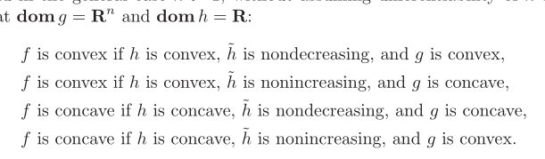
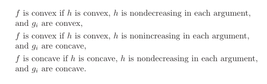
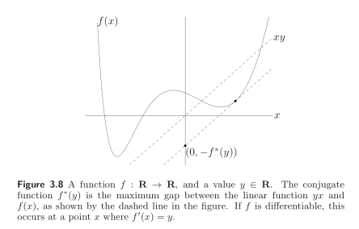
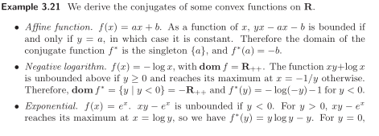
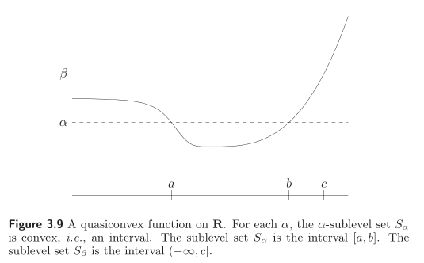
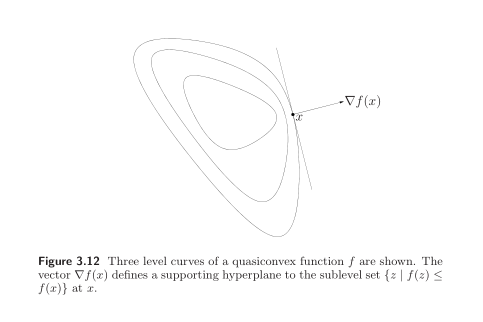

# Notes for "Convex Optimization"
## Chapter 3: Convex Function
### Convex Function Definition
A function: $f:R^n \rightarrow R$ is convex if $\mathbf{dom}f$ is convex set and if for all $x, y \in \mathbf{dom}f$, and $\theta$ with $0 \leq \theta \leq 1$, we have
$$
f(\theta x + (1-\theta)y) \leq \theta f(x) + (1-\theta)f(y)
$$ 
A function is convex if and only if it is convex when restricted to any line that intersects its domain.  
We can construct a line:
$$
g (t)= \{x+tv\}
$$
The intersection between g and $\mathbf{dom} f$ is $\{x+tv \in \mathbf{dom}f\}$. Then $f(x)$ is convex if and only if 
$$
g(t)=f(x+tv), x+tv \in \mathbf{dom}f
$$
is convex.

__Extended-value extensions:__  
$$
\widetilde{f}(x)= \begin{cases}  
f(x) & x \in \mathbf{f} \\
\infty & x \notin \mathbf{f}
\end{cases}$$

### First order condition
Suppose $f$ is differentiable, $f$ is convex if and only if $\mathbf{dom} f$ is convex and
$$
f(y) \geq f(x) + \nabla f(x)^T(y-x)
$$
holds for all $x,y \in \mathbf{dom}f$.

### Second order condition
Assume that $f$ is twice differentiable. Then $f$ is convex if and only if $mathbf{f}$ is convex and its Hessian is positive semidefinate: for all $x \in \mathbf{dom} f$,
$$
\nabla^2f(x) \succeq 0
$$

__Note: The separate requirement that $\mathbf{dom} f$ be convex cannot be dropped from the first- and second-order characterizations of convexity.__  

### Proof for First- and Second-order conditions
Details can be found in:  
http://yangzhou301.xyli.me/2016/03/14/826442654/

### Sublevel sets
The $\alpha$-sublevel set of a function $f: R^n \rightarrow$ is defined as
$$
C_a = \{x \in \mathbf{dom} f | f(x) \leq \alpha\}
$$
Sublevel set of a convex function is convex.

### Epigraph
Epi meas above so epigraph means above the graph
$$
\mathbf{epi} f = \{(x, f(x))|x \in \mathbf{dom} f\}
$$
A function is convex if and only if its epigraph is convex set.

### Jensen's inequality and extensions
If $f$ is convex, $x_1,..., x_k \in \mathbf{dom}f$, and $\theta_1,...,\theta_k \leq 0$ with $\theta_1 +...+\theta_k =1$, then
$$
f(\theta_1 x_1+...+\theta_k x_k) \leq \theta_1 f(x_1)+...+\theta_k f(x_k)
$$
It can extends to __integrals and probability__.

### Operations that preserve convexity
#### 1. Nonnegative weighted sums
$$
f = w_1f_1+...+w_kf_k, w_i \geq 0
$$
It can extends to __integrals and probability__.

#### 2. Composition with an affine mapping
Suppose $f:R^n \rightarrow R, A \in R^{n \times m}$ and $b \in R^n$, Define $g:R^n \rightarrow R$ by
$$g(x)=f(Ax+b)$$ with $\mathbf{dom} g = \{x|Ax+b \in  \mathbf{dom}f\}$. Then, if $f$ is convex, so is $g$.

#### 3. Pointwise maximum and supremum
If $f_1,...,f_m$ are convex, then their pointwise maximum 
$$f(x) = \max \{f_1(x),...,f_m(x)\}$$

#### 4. Composition
$h:R^k \rightarrow R$ and $g:R^n \rightarrow R^k$, guarantee convexity of their composition $f = h(g(x)):R^n \rightarrow R$, defined by 
$$
f(x)=h(g(x)), \quad \mathbf{dom} f = \{x \in \mathbf{dom}g|g(x) \in \mathbf{dom} h\}
$$

Note the requirement that monotonicity hold for the extended-value extension $\widetilde{h}$ and not just the function $h$.

__Vector composition:__  
$$
f(x) = h(g(x))=h(g_1(x),...,g_k(x)) \\
f''(x)=g'(x)^T \nabla^2 h(g(x))g'(x)+ \nabla h(g(x))^T g''(x)
$$

#### 5. Perspective of a function
If $f:R^n \rightarrow R$, then the perspective of $f$ is the function $g:R^{n+1} \rightarrow R$ defined by 
$$g(x,t)=tf(x/t)$$ with domain
$$\mathbf{dom}g=\{(x,t)|x/t \in \mathbf{dom} f, t>0\}$$ 
If $f$ is convex function, then so is tis perspective function.

### The conjugate function
__Definition:__  
Let $f:R^n \rightarrow R$. The function $f^*:R^n \rightarrow R$, defined as
$$
f^*(y)=\sup\limits_{x \in \mathbf{dom}f}(y^Tx-f(x))
$$
is called the conjugate of the function $f$.

__$f^*$ is a convex function whether or not $f$ is convex.__  
Some examples are listed to explain how to conduct the conjugate function.

__Basic properties:__  
1. Fenchel's inequality
$$
f(x)+f^*(y) \geq x^Ty
$$
2. Conjugate of the conjugate
if $f$ is convex and $f$ is closed, then $f^{**}=f$
3. Scaling and composition with affine transformation
For $a>0$ and $b \in R$, the conjugate of $g(x)=af(x)+b$ is $g^*(y)=af^*(y/a)-b$  
Suppose $A \in R^{n \times n}$ is onosingular and $b \in R^n$, the conjugate of g(x)=f(Ax+b) is 
$$
g^*(y)=f^*(A^{-T}y)-b^TA^{-T}y
$$ with $\mathbf{dom}g^*=A^T \mathbf{dom} f^*$
4. Sums of independent functions
$$
f^*(w,z)=f^*_1(w)+f^*_2(z)
$$

### Quasiconvex function
#### 1. Definition
A function $f:R^n \rightarrow R$ is called quasiconvex if its domain and all its sublevel sets
$$S_a = \{x \in \mathbf{dom}f|f(x)\leq \alpha\}$$ for $\alpha \in R$ are convex.

#### 2. Basic properties
A function $f$ is quasiconvex if and only if $\mathbf{dom} f$ is convex and for any $x, y \in \mathbf{dom} f$ and $0 \leq \theta \leq 1$,
$$
f(\theta x+(1-\theta)y) \leq \max \{f(x), f(y)\}
$$

#### 3. Differentiable quasiconvex functions
__First-order conditions:__  
Suppose $f:R^n \rightarrow R$ is differentiable. Then $f$ is quasiconvex if and only if $\mathbf{dom} f$ is convex and for all $x, y \in \mathbf{dom} f$
$$
f(y) \leq f(x) \Rightarrow \nabla f(x)^T(y-x) \leq 0
$$

Proof: https://blog.csdn.net/wang136958280/article/details/86549034

