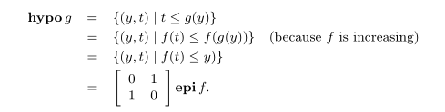

# Question List for Convex Optimization
## Chapter 3
1. 集合左乘矩阵是什么意思？

2. 变上限积分求导：Leibniz integral rule

3. 复合函数求导
$$
g(t)=f(x_0+tv)\\
g''(t)=v^T \nabla^2f(x^0+tv)v \leq 0
$$
4. 什么是仿射变换：
仿射变化：平移+旋转+缩放 (在高一维空间中左乘矩阵)
线性变换：旋转+缩放 （左乘矩阵）
通俗的来说，仿射变化就是把低维的图形在高一维的空间中进行线性变化，实现平移的效果.
https://www.matongxue.com/madocs/244.html