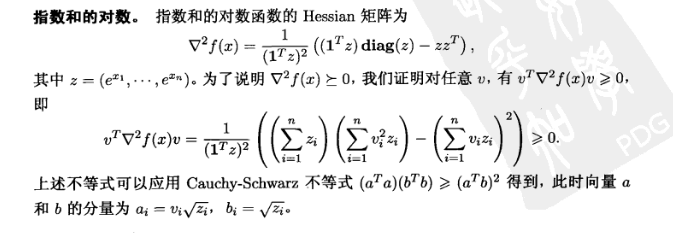
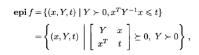
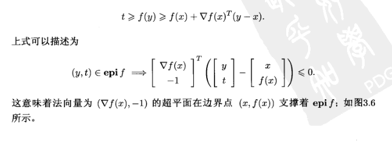
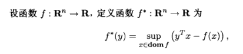
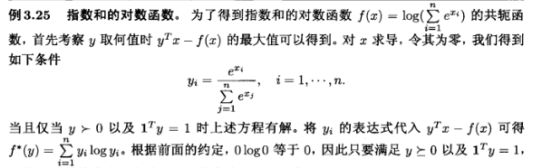

# Question List for Convex Optimization
## Chapter 3
1. 集合左乘矩阵是什么意思？

2. 变上限积分求导：Leibniz integral rule

3. 复合函数求导
$$
g(t)=f(x_0+tv)\\
g''(t)=v^T \nabla^2f(x^0+tv)v \leq 0
$$
4. 什么是仿射变换：
仿射变化：平移+旋转+缩放 (在高一维空间中左乘矩阵)
线性变换：旋转+缩放 （左乘矩阵）
通俗的来说，仿射变化就是把低维的图形在高一维的空间中进行线性变化，实现平移的效果.
https://www.matongxue.com/madocs/244.html

5. 指数和的对数是凸函数
$$f(x)=log(e^{x_1}+...+e^{x_n})$$

6. 不等式和矩阵半正定的转化

    下面矩阵的Schur补其实就为$S=t-X^TY^{-1}X$, 因为下面那个矩阵半正定的条件之一是行列式不小于0，由$\det X=\det A \det S$

7. epigraph和支撑超平面

    If for any $x \in C$, we have $a^Txx \leq a^Tx_0$, then we say the hyperplane $\{x|a^Tx=a^Tx_0\}$ is the support hyperplane for set $C$ at point $x_0$.  
    上图中，$x_0$为$(x, f(x))$，而$(y,t) \in \mathbf{epi} f$
8. 共轭函数（上确界的含义）

    上述函数含义为：固定y，使括号内函数有上界的y的函数。求法：对括号中函数对x求导，判断y在何区间中可以使得括号内函数有上界，最后令$f'=0$，获得y关于x的表达式并带入原函数。
9. 指数和的对数的共轭函数（如何构造）
