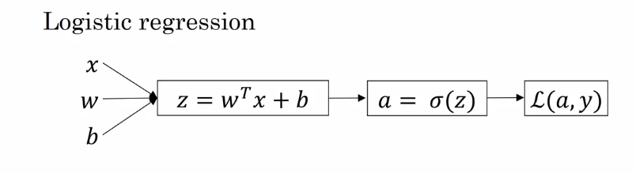
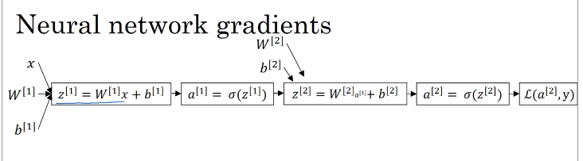
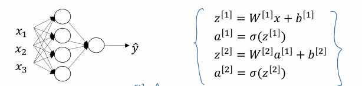
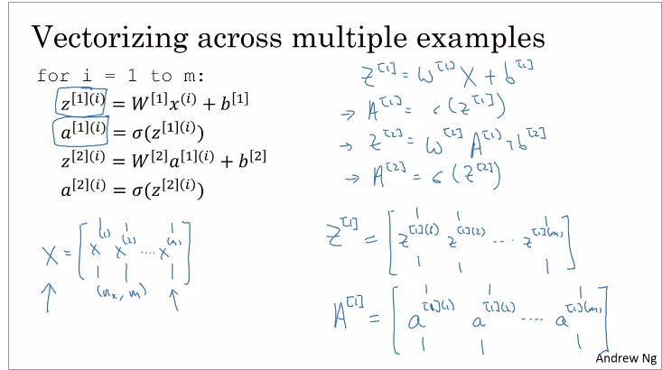
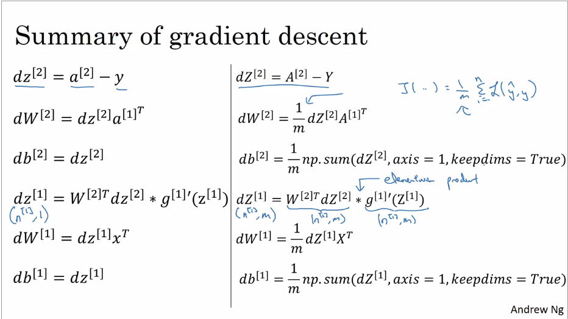
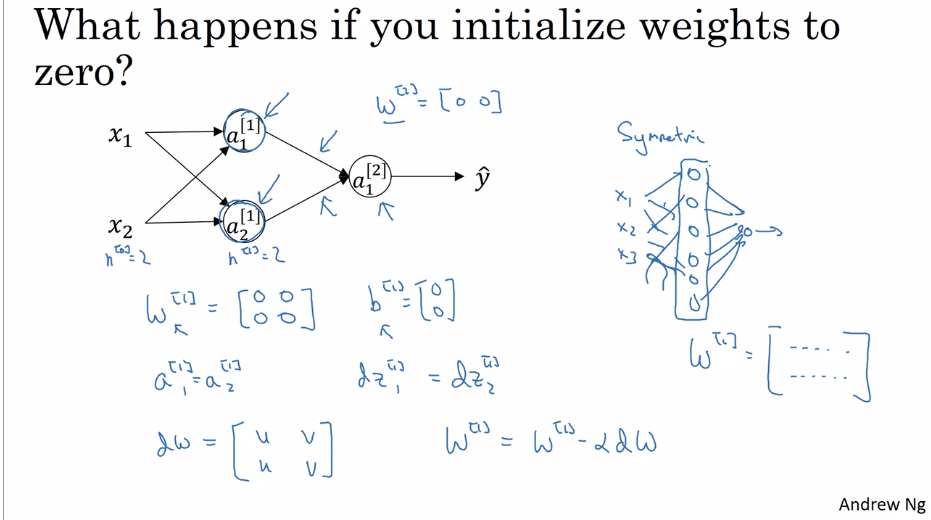

# Deep Learning
## This note records some important knowledges and mathematical derivations for Deep Learning Specialization provided by deeplearning.ai.
### Course 1: Neural Networks and Deep Learning
#### Week 3 
##### Derivations of Forward propagation and Back propagation
__Forward propagation:__ calculate the loss function.  
__Back propagation:__ calculate the gradients.  
向前传播即为计算神经网络的输出和loss function, 向后传播即为计算各个参数的偏导从而施行梯度下降。本笔记补充了Coursera上吴恩达deep learning课中有关向后传播的数学推导，推导过程中应用了大量的矩阵求导知识，详细请参考附录《矩阵求导术》。  

__Note:__  
1. $*$ represents the elementary product.
2. $g(x)$ or $\sigma(x)$ represents the activation function, in this note is sigmoid function.

__1. Logistic Regression (single sample)__  

$x,w \in R^{n_x \times 1}, z,a,y,L \in R$
_Forward propagation:_  
$z = w^Tx+b$  
$a = \sigma(z) = \frac{1}{1+\exp(-z)}$
$L(a,y)=-y\log{a}-(1-y)\log{(1-a)}$  
where $L(a,y)$ can be also expressed as:  
$L(a,y)=-y\log{a}-(1-y)\log{(1-a)}$  
$\quad \quad \quad = -y\log{\frac{1}{1+\exp(-z)}}-(1-y)\log{(1-\frac{1}{1+\exp(-z)})}$  
$\quad \quad \quad = y\log\frac{1-a}{a}-\log(1-a)$  
$\quad \quad \quad = y\log \exp(-z)-\log(\frac{1}{1+\exp(z)})$  
$\quad \quad \quad = y(-z)+\log(1+\exp(z))$  
$\quad \quad \quad = -y(w^Tx+b)+\log(1+\exp(w^Tx+b))$  
_Back propagation:_  
we need to obtain the partial derivatives $\frac{\partial L}{\partial w}$ and $\frac{\partial L}{\partial b}$  
$dL = -y (dw^T)x - yw^T(dx)-ydb+d\log(1+w^Tx+b)$  
$\quad \quad \quad = -y (dw^T)x - yw^T(dx)+\frac{\exp(w^Tx+b)}{1+\exp(w^Tx+b)}d(w^Tx+b)$  
for $w$:  
$d_wL=tr(-y (dw^T)x+a(dw^T)x)=tr(x(a-y)(dw)^T)$  
we can get:
$\frac{\partial L}{\partial w}=x(a-y)$  
for $b$:
$d_bL=tr(-ydb+adb)=tr((a-y)db)$  
we can get:  
$\frac{\partial L}{\partial b} = a-y$  

__2. Logistic Regression (multiple samples)__  
We define
$$
X = [x^{(1)}, x^{(2)}, ..., x^{(m)}]
$$
where $x^{(i)} \in R^{n_x \times 1}$, so $X \in R^{n_x \times m}$ (the sample number is $m$)  
$w\in R^{n_x \times 1}$  
$Y,Z,A,b \in R^m$  
$J \in R$  
_Forward propagation:_  
$Z = X^Tw+\bm{1}b$  
$A = \sigma(Z) = \frac{1}{1+\exp(-Z)}$
$J(w,b)=\frac{1}{m}\Sigma_{i=1}^m L=\Sigma(-y_i\log{a_i}-(1-y_i)\log{(1-a_i)})$  
Similarly, we can write $J$ as:  
$J=\frac{1}{m}(-Y^T(X^Tw+\bm{1}b)+\bm{1}^T\log(\bm{1}+\exp(X^Tw+\bm{1}b)))$  
where $\bm{1} \in R^m$ is unit vector.  
$dJ = \frac{1}{m}(-Y^T(dX^T)w-Y^TX^T(dw)-Y^T\bm{1}(db)+\bm{1}^T\frac{\exp(X^Tw+b)}{\bm{1}^T+\exp(X^Tw+b)}((dX^T)w+X^Tdw+\bm{1}db)$  
$\quad = \frac{1}{m}(-Y^T(dX^T)w-Y^TX^T(dw)-Y^T\bm{1}(db)+ \bm{1}^T(A*((dX^T)w+X^Tdw+\bm{1}db)))$  
$\quad = \frac{1}{m}(-Y^T(dX^T)w-Y^TX^T(dw)-Y^T\bm{1}(db) + (\bm{1} * A)^T ((dX^T)w+X^Tdw+\bm{1}db))$
_Back propagation:_  
for $w$:  
$d_wJ=-\frac{1}{m}(Y^TX^T(dw)+A^TX^Tdw=tr((A^T-Y^T)X^Tdw))$  
so we can get:  
$\frac{\partial J}{\partial w}=\frac{1}{m}((A^T-Y^T)X^T)^T=\frac{1}{m}X(A-Y)$  
as for $b$:  
$\frac{\partial J}{\partial b}=\frac{1}{m}((A^T-Y^T)\bm{1})^T=\frac{1}{m}\bm{1}^T(A-Y)$ 

__3. Neural Network (two layer)__  

_Forward propagation:_  

where $X \in R^{n_x \times m}, W^{[1]}\in R^{n^{[1]} \times n_x}, W^{[2]}\in R^{n^{[2]} \times n^{[1]}}$  
$Z^{[1]},A^{[1]},b^{[1]} \in R^{n^{[1]} \times m}$  
$Z^{[2]},A^{[2]},b^{[2]} \in R^{n^{[2]} \times m}$  
$Y \in R^{n^{[2]} \times m}$
where $n^{[2]}=1$.  

The loss function is  
$J=\frac{1}{m}\Sigma_{i=1}^m L(a^{[2]},y)$  

We can define $b_1 \in R^{n^{[1]}}, b_2 \in R^{n^{[2]}}$ as  
$b_1\bm1^T=b^{[1]},b_2\bm1^T=b^{[2]}$  
where $\bm1 \in R^m$ is unit column vector.  

We can see the derivation from $A^{[1]}$ to $J$ is the same with that in Logistic Regression, so we can get:  
$J = \frac{1}{m}(-(W^{[2]}A^{[1]}+b_2\bm1^T)Y^T+\log(\bm{1}+\exp(W^{[2]}A^{[1]}+b_2\bm1^T))\bm1)$  

_Backward propagation:_  
$dJ = \frac{1}{m}(-d(W^{[2]}A^{[1]}+b_2\bm1^T)Y^T+d(\log(\bm{1}+\exp(W^{[2]}A^{[1]}+b_2\bm1^T))\bm1))$  
$\quad = \frac{1}{m}(-d(W^{[2]}A^{[1]}+b_2\bm1^T)Y^T+\frac{\exp(W^{[2]}A^{[1]}+b_2\bm1^T)}{\bm1+\exp(W^{[2]}A^{[1]}+b_2\bm1^T)}*(d(W^{[2]}A^{[1]}+b_2\bm1^T))\bm1$  
$\quad =\frac{1}{m}tr(-Y^Td(W^{[2]}A^{[1]}+b_2\bm1^T)+A^{[2]}*d(W^{[2]}A^{[1]}+b_2\bm1^T)\bm1)$  
$\quad = \frac{1}{m}tr(-Y^Td(W^{[2]}A^{[1]}+b_2\bm1^T)+\bm1(A^{[2]}*d(W^{[2]}A^{[1]}+b_2\bm1^T)))$  
$\quad = \frac{1}{m}tr(-Y^Td(W^{[2]}A^{[1]}+b_2\bm1^T)+(\bm1^T*A^{[2]})^Td(W^{[2]}A^{[1]}+b_2\bm1^T))$  
$\quad = \frac{1}{m}tr(-Y^Td(W^{[2]}A^{[1]}+b_2\bm1^T)+(A^{[2]})^Td(W^{[2]}A^{[1]}+b_2\bm1^T))$  

for $W^{[2]}$, we have  
$d_{w_2}J=\frac{1}{m}tr(-Y^Td(W^{[2]})A^{[1]}+(A^{[2]})^Td(W^{[2]})A^{[1]})$  
$\quad = \frac{1}{m}tr(-A^{[1]}Y^TdW^{[2]}+A^{[1]}(A^{[2]})^TdW^{[2]})$  
$\quad = \frac{1}{m}tr(A^{[1]}((A^{[2]})^T-Y^T)dW^{[2]})$  
so we can get  
$\frac{\partial J}{\partial W^{[2]}}=\frac{1}{m}(A^{[2]}-Y)(A^{[1]})^T$  

for $b_2$, we have  
$d_{b_2}J=\frac{1}{m}tr(-Y^Td(b_2\bm1^T)+(A^{[2]})^Td(b_2\bm1^T))$  
$\quad = \frac{1}{m}tr((\bm1^T(A^{[2]})^T-Y^T)db_2)$  
so we can get  
$\frac{\partial J}{\partial b_2}=\frac{1}{m}(A^{[2]}-Y)\bm1$  

For the first layer(from $X$ to $A^{[1]}$), we can get  
$dJ = \frac{1}{m}tr((A^{[2]}-Y)^Td(W^{[2]}A^{[1]}+b_2\bm1^T))$  

for $W^{[1]}$, we have  
$d_{w_1}J=\frac{1}{m}tr((A^{[2]}-Y)^TW^{[2]}d(g(Z^{[1]})))$  
$\quad = \frac{1}{m}tr((A^{[2]}-Y)^TW^{[2]}g'(Z^{[1]})*dZ^{[1]})$  
$\quad = \frac{1}{m}tr(((A^{[2]}-Y)^TW^{[2]})^T*g'(Z^{[1]})dZ^{[1]})$  
$\quad = \frac{1}{m}tr((W^{[2]})^T (A^{[2]}-Y)*g'(Z^{[1]})d(W^{[1]}X+b_1\bm1^T))$  
$\quad = \frac{1}{m}tr(((W^{[2]})^T (A^{[2]}-Y)*g'(Z^{[1]}))^Td(W^{[1]})X)$  
$\quad = \frac{1}{m}tr(\quad X((W^{[2]})^T (A^{[2]}-Y)*g'(Z^{[1]}))^T \quad dW^{[1]})$  
so we can get  
$\frac{\partial J}{\partial W^{[1]}}=\frac{1}{m}[X((W^{[2]})^T (A^{[2]}-Y)*g'(Z^{[1]}))^T]^T$  
$\quad \quad = \frac{1}{m}(W^{[2]})^T (A^{[2]}-Y)*g'(Z^{[1]})X^T$  

as for $b_1$, we have  
$d_{b_1}J=\frac{1}{m}tr((W^{[2]})^T (A^{[2]}-Y)*g'(Z^{[1]})d(b_1\bm1^T))$  
$\quad = \frac{1}{m}tr(\quad \bm1^T((W^{[2]})^T (A^{[2]}-Y)*g'(Z^{[1]}))^T \quad db_1)$  

so we can get  
$\frac{\partial J}{\partial b_1}=((W^{[2]})^T (A^{[2]}-Y)*g'(Z^{[1]}))\bm1$  

##### Summary
__Neural Network (two layer)__  
$$\frac{\partial J}{\partial W^{[2]}}=\frac{1}{m}(A^{[2]}-Y)(A^{[1]})^T$$
$$\frac{\partial J}{\partial b_2}=\frac{1}{m}(A^{[2]}-Y)\bm1$$
$$\frac{\partial J}{\partial W^{[1]}}=\frac{1}{m}(W^{[2]})^T (A^{[2]}-Y)*g'(Z^{[1]})X^T$$
$$\frac{\partial J}{\partial b_1}=((W^{[2]})^T (A^{[2]}-Y)*g'(Z^{[1]}))\bm1$$

##### Random Initialization
If we initialize weights to zero, then each neural unit in one layer will do the same work, so the their weights will be also same, which is called "symmetric breaking".  
So random initialization is often used to initialize the weight matrice. Small number is used to randomly initialize the weight matrice. If we use a large number, then $Z$ will be large, so $|g(Z)|$ will be also large, but the corresponding gradient will be very small, which may require a long time to find the convergent results.  

##### Appendix
Matrice Derivation:  
1. 矩阵求导术（上） https://zhuanlan.zhihu.com/p/24709748
2. 矩阵求导术（下） https://zhuanlan.zhihu.com/p/24863977

