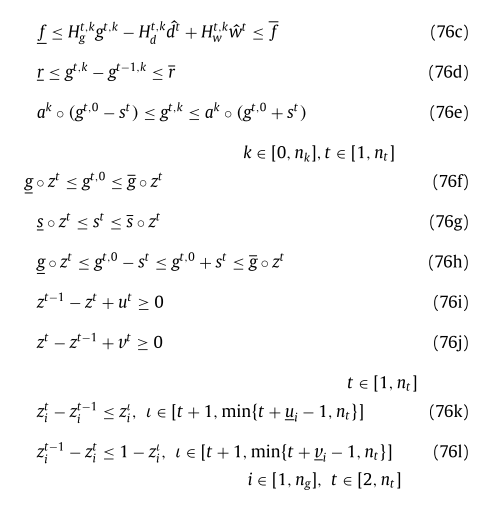

---
export_on_save:
 html: true
---
# Notes for Paper 1
## Paper 1
### __Title:__ Data-driven decision making in power systems with probabilistic guarantees: Theory and applications of chance-constrained optimization  
### __Authors:__ Geng Xinbo, Xie Le  
### __Journal:__ Annual Reviews in Control 
### __Tags__: chance-constraint; optimization; power system; data-driven
### __Notes:__  
#### 1. Problem description:
The problem of __Chance-constrained optimization(CCO)__ can usually be expressed like this:  
$\min \limits_{x}\quad c^Tx\\
\quad s.t.\quad P_{\varepsilon}(f(x, \varepsilon)\leq 0) \geq 1 - \epsilon\\
\quad \quad x\in \chi$  

This kind of problem can be converted into another type:  
Violation Probability: $V(x^o) :=  P_{\varepsilon}(f(x, \varepsilon)\geq 0)$  
where $x^o$ is a feasible solution to CCO.  
Define:  
$$F_\epsilon := \{x\in R^n : V(x) \leq \epsilon\} = \{x\in R^n : P_{\varepsilon}(f(x, \varepsilon)\geq 0) \leq 1 - \epsilon\}$$
Then, $x^o$ is feasible to CCO if $x \in \chi \cap F_\epsilon$.  
So CCO can be equivalently written as:  
$\min \limits_{x}\quad c^Tx\\
\quad s.t.\quad V(x)\leq\epsilon\\
\quad \quad x\in \chi$  

So, the first step is checking its __feasibility__ ($x^o$ satisfies the constraint), then is checking its __optimality__ (the distance between the corresponding $o^o$ and the best optimal value $o^*$).   

#### 2. difficulties or issues: 
There are __two main difficulties__ to solve the problems:  
(D1) calculating the probability involves multivariate inte- gration, which is NP-Hard.  
(D2) feasible region $F_\epsilon$ is often non-convex 

#### 3. Methods

##### __Scenario approach__  
Scenario approach  utilizes a dataset witg N scenarios $\{\varepsilon_i\}^N_{i=1}$ to approximate CCO:  
$(SP_N)\min \limits_{x\in \chi}\quad c^Tx$  
$\quad s.t.\quad f(x, \varepsilon^1)\leq 0,...,f(x, \varepsilon^N)\leq 0$  
Because massive scenario number $N$ will cause huge computation problem, so it involves another question: how to find the suitable scenario number (sample complexity $N$)?  
__a. A-priori feasibility guarantees__  
steps:  
1. exploring the problem structure and obtain the upper bound $\overline{h}$ on the number of support scenarios;
2. choosing a good sample complexity $N$
3. Solving $SP_N$ and obtain $x^*_N$ and $o^*_N$  

Many scholars make efforts on how to find the upper bound $\overline{h}$ and the good sample comlexity $N$  
 
__b. A-posteriori feasibility guarantees__  
steps:
1. given dataset $\{\varepsilon_i\}^N_{i=1}$ solve $SP_N$ and obtain $x^*_N$;
2. find the support scenarios number (denoted as $s^*_N$)
3. calculate the posterior violation probability $\epsilon(\beta, s^*_N, N)$
4. if  $\epsilon(\beta, s^*_N, N)\geq{\epsilon}$, repeat step 1 to 3 with more scenarios until reaching $\epsilon(\beta, s^*_N, N)\leq{\epsilon}$. If all available scenarios are used but still fails to reach the condition, then it might be impossible to obtain a solution $x^*_N$.

 $\epsilon(\beta, s^*_N, N)$ is the solution in the interval $(0,1)$ of the equality below:
$$\frac{\beta}{N+1}\sum_{i=k}^{N}
  \left(
  \begin{matrix}
   i  \\
   k 
  \end{matrix}
  \right)
  t^{i-k}-
  \left(
      \begin{matrix}
      N  \\
      k 
      \end{matrix}
      \right)
  t^{i-k} = 0
$$

where $\beta\in{(0,1)}$

Many scholars make efforts on how to find the upper bound $\overline{\epsilon}$. If $\overline{\epsilon}<\epsilon$, then $x^o$ is feasible.

__c. Optimality guarateens__  
The optimality checking is conducted by constructing lower bounds <u>o</u> on $o^*$  

##### Sample average approximation
Sample average approximation converts CCO into:
$(SAA):\min \limits_{x}\quad c^Tx$  
$\quad s.t.\frac{1}{N}\sum_{i=1}^{N}
1_{\overline{f}(x,\varepsilon^i)>0}\leq{\varepsilon}$

where 
$
\overline{f}(x,\varepsilon^i) 
:= 
\max{\{f_1(x,\varepsilon), ..., f_m(x,\varepsilon)\}}
$ and the violation probability $\varepsilon$ differs from $\epsilon$ in CCO.  
__Data-driven:__ SAA approximates the true distribution from N samples $\{\varepsilon_i\}^N_{i=1}$.  

SAA further converts CCO into:  
$\min\limits_{x,z}c^Tx\\
\quad s.t.\quad f(x,\varepsilon^i)-Mz_i1_m\leq 0  \\
\quad\quad\quad \frac{1}{N}\sum_{i=1}^{N}z_i\leq\varepsilon\\
\quad \quad x\in \chi, z_i\in\{0,1\}, i = 1, 2,..., N$  
Because $M$ are big coefficients (weak formulations), it may cause numerical issues. Many scholars pay their attention on finding strong formulations without big coeffiecients $M$.  

__a. feasibility guarantees__  
The feasible region of SAA is defined as:
$$
F_{\varepsilon, \gamma}^N
:=
\{
    x\in\chi:
    \frac{1}{N}\sum_{i=1}^{N}1_{\overline{f}(x,\varepsilon^i)+\gamma\leq 0}\geq{1-\varepsilon}
    \}
$$
Solutions of SAA is feasible to CCO with high probability $1-\beta$:  
$$
P(F_{\varepsilon, \gamma}^N\subseteq{F_\epsilon})\geq{1-\beta}
$$
__b. optimality guarantees__  
use SAA to generate lower bounds of CCO $o_L^*$ with probability at least $1-\delta$.

##### Robust optimization related methods
Robust optimization's typical form is:
$$
(RC):\min \limits_{x\in\chi} \quad c^Tx\\
s.t. \quad f(x, \varepsilon)\leq 0, \in U_\epsilon
$$
RC finds the optimal solution which is feasible all realizations of uncertainties. The key point is how to construct an good uncertainty set $U_\epsilon$.  
Two points for an good uncertainty set:  
1. RC is computationally tractable.
2. The optimal solution of RC is not too conservative.  
Many scholars made efforts on the second point.  

__safe approximation__  
$$
(SA):\min \limits_{x\in\chi} c^Tx\\
s.t. \quad x \in \underline{F}
$$
where $underline{F} \subseteq{F_\epsilon}$. $F_\epsilon$ is the feasible region of CCO.  

The authors used a large space to talk how to find the uncertainty sets by applying safe approximation in __individual chance constraints__. However, it is hard for a rookie like me to figure out the mathematical derivation in each step.  
Authors introduced several approaches to apply safe approximation into joint chance constrains:  
1. convert joint chance constrains to individual chance constrains. For example, use 
$
P\left(
    f_i(x, \varepsilon)\leq{1-\epsilon_i}, 
    \quad
    i = 1, ..., m
    \right)
$  
or use the pointwise maximum
$\overline{f}(x, \varepsilon):=\max \{f_1(x, \varepsilon),...,f_m(x, \varepsilon)\}$
2. directly deal with joint chance constraints.Authors introduced three typical approaches.  

__(The mathmatic part is over, next is application part.)__
#### Applications in power systems
Pivotal task: maintain the real-time balance of supply and demand while ensuring the system is low-cost and reliable.
##### Security-constrained economic dispatch(SCED)
__a. Deterministic SCED:__ no uncertainties.
Example: direct current optinam power flow (DCOPF)
$$
(det-DCOPF): \min \limits_{g} c(g) \\
s.t \quad 
1^Tg = 1^Td - 1^T \hat{w} \\
f = H_{g}g + H_{w}W-H_{d}d \\
\underline{f} \leq f \leq \overline{f} \\
\underline{g} \leq g \leq \overline{g}
$$
where decision varibles are generation output levels $g \in R^{n_g}$. $c(g)$ is the total generation cost, $1^Td - 1^T \hat{w} $ is net demands, $H$ is power transfer distribution factor (PTDF) matrix, $f$ is transmission line flows, $\hat{w}$ is wind generation.  

__b. Chance-constrained SCED__  
Treat wind generation $w$ as a random vector.
$$
(cc-DCOPF): \min \limits_{g,\eta} c(g) \\
s.t \quad 
1^Tg = 1^Td - 1^Tw \\
f(\hat{w}, \widetilde{w}) = H_{g}(g-1^T \widetilde{w} \eta) -H_{d}d + H_{w}(\hat{w}+\widetilde{w}) \\
P_{\hat{w}}(\underline{f} \leq f(\hat{w}, \widetilde{w}) \leq \overline{f} \quad and \quad \underline{g} \leq {g-1^T \widetilde{w} \eta} \leq \overline{g}) \geq{1-\epsilon} \\
1^T \eta = 1 \\
\underline{g} \leq g \leq \overline{g} \\
-1 \leq \eta \geq 1
$$
where $\eta$ is affine control policy $\eta \in [-1,1]^{n_g}$ (proportionally allocate total wind fluctuations to each generate), it's also called participation factor or dustribution vector.

##### Security-constrained unit commitment(SCUC)
SCUC is used to minimize the generation cost.  
__Deterministic SCUC__  
$
(det-SCUC):
\min \limits_{z,u,v,g,s} \sum_{t=1}^{n^t}c_n^T z^t+ c_u^T u^t + c_v^T v^t + c_g^T g^{t,0} + c_s^T s^t \\
s.t. \quad 1^T g^{t, k} \geq 1^T \hat{d^t} - 1^T \hat{w}^t
$

Objective function is total operation costs, including no-load costs $c_n^T z^t$, startup costs $c_u^T u^t$, shutdown costs $c_v^T v^t$, generation costs $c_g^T g^{t,0}$ and reserve costs $c_s^T s^t$.  
The first constraint assures enough supply to meet net demand.  
Constraints (76c), (76d) and (76g) are about transmission capacity, generation ramping capability and reserve limit in contingency scenario k at time t.  
Constraints (76f) and (76g) are generation and reserve capacity.  
(76i)-(76j) are logistic constraints about commitment status, startup and shutdown decisions.  
Constraints (76k)-(76l) are minimum on/off time constraints for all generators.  
Deterministic SCUC has no uncertain variables

__Chance-constrained SCUC__  
  
Wind generation os modeled as a random vector consisting of a deterministic predicted component $\hat{w} \in R^{n_w}$ and a stochastic error component $\widetilde{w} \in R^{n_w}$  
The demand is also treated as a random vector with deterministic component $\hat{d}$ and a stochastic error component $\widetilde{d}$.

__solving chance-constrained SCUC__  
Sample average approximation is commonly used. There is no upper bound on the number of support scenarios for non-convex problems, so the scenario approach cannot be directly applied on cc-SCUC.

##### Generation and transmission expansion Generation
__a. Purposes:__
1. when to invest on new elements such as transmission lines and generators;
2. what types of new elements are necessary;
3. how much capacity is needed and where the best location would be for those new elements.

__b. Objective function:__  
1. total cost of investment in new generators and transmission line;
2. environmental impacts;
3. cost of generation.

__c. Constrains:__  
1. total or individual costs within budget;
2. capacity constriant;
3. reliability requirement;
4. supply-demand balance;
5. power flow equations;
6. operation requirements such as generation or transmission limits.

__d. Uncertainties:__
1. demand;
2. generation;
3. transmission outages;
4. renewables.

