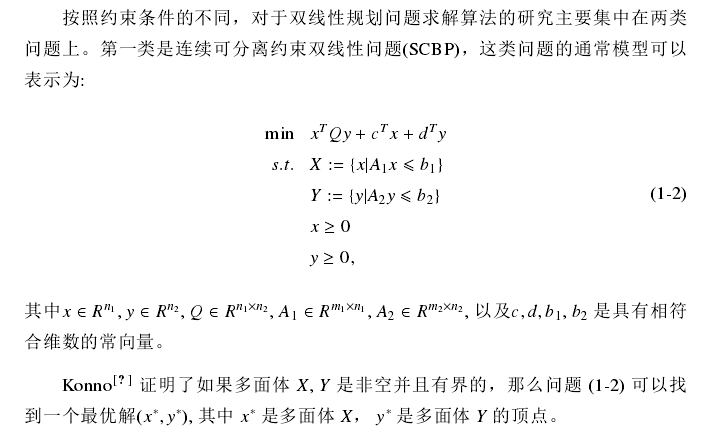
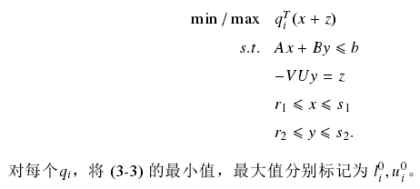
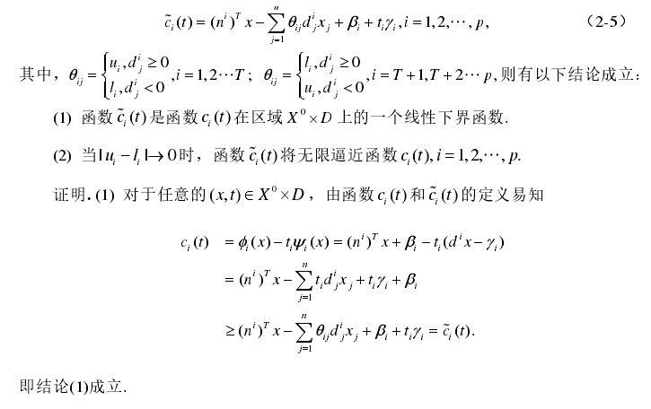
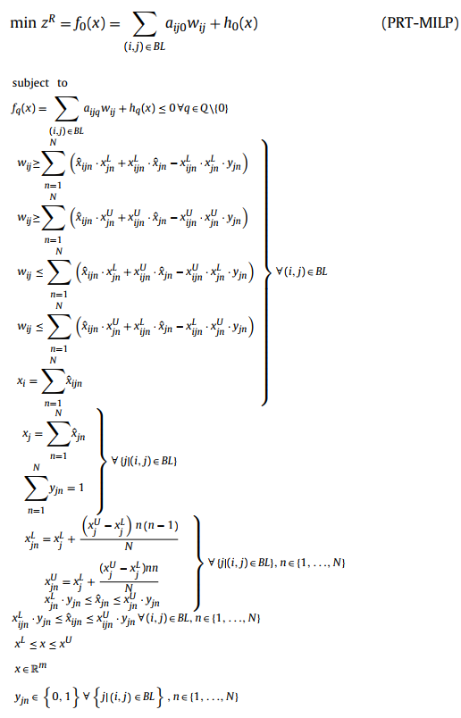

# A survey of techniques for bilinear programming

## 1. Definition [1]
  
### 1.1 SCBP
  
### 1.2 JCBP
  

## 2. Relaxation for non-convex QCQP
### 2.1 Problem description [1]
  
### 2.2 Semidefinite relaxation [1]

### 2.3 reformulation-linearization-technique

### 2.4 Convex envelope and relaxation [1]

  
where $x^TQy$ is a scalar value, so $(x^TQy)^T=x^TQy$  
__Relaxation:__  
1. find the lower and upper bounds of $q^T_i(x+z)$:  
  
2. Relaxation  
  
because $(u-q^Tx)(q^T-l) \geq 0$
3. Relaxed QCQP  
  
The maximum gap should be:  
  

This kind of method is called "McCormick envelopes", details can be found in https://optimization.mccormick.northwestern.edu/index.php/McCormick_envelopes
### 2.5 Linear relaxation for Fractional Programming [2]
#### 2.5.1 Original problem
  
Where $\phi_i(x),\psi_i(x)$ are affine functions.  
Without loss of generality, we can assume:  
$\phi_i(x) \geq 0,\psi_i(x) > 0$
#### 2.5.2 find the upper and lower bounds
  
We can assume that without loss of generality:    
   
Then we can get the equivalence problem:  

#### 2.5.3 Linear relaxation
Define a $ \widetilde{c}_i(x) \in X^0 \times D$:  
  
Then we can get the Relaxed linear programming problem:  

### 2.6 Convex relaxation for GLMP [2]
#### 2.6.1 Problem description

#### 2.6.2 First convex relxation method
Step 1: Get the initial variable boundary:  
  
Step 2: Get the upper and lower bounds of affine functions:  
 
Step 3: Get the upper and lower bounds of bilinear terms

Step 4: Relax the original problem  

#### 2.6.3 Second convex relaxtion method
Step 1-4 are the same with these in Method 1.  
Step 5: Add one more relaxation  
  
Step 6: Get the LRMP0  
 

### 2.7 With a bilinear constrait
#### 2.7.1 Original problem
  
It can be converted into a convex optimization problem (SDP)  
  

### 2.8 Improvements on McCormick envelopes
Original problem:  
  
#### 2.8.1 Uniform partitions for bilinear terms' domain [3]
A tighter mixed-integer linear programming (MILP) relaxation can be constructed by partitioning the domain of one of the variables ($x_j$) of the bilinear term into n disjoint regions, with new binary variables being added to the formulation to select the optimal partition for $x_j$. 
  
 
#### 2.8.2 Partition-dependent lower and upper bounds [4]
  
Details can be found in [4]

#### 2.8.3 convex hull reformulation [5]
  
 

### Reference
[1] 姜珊. (2015). 双线性规划问题的凸松弛求解方法研究 (Master's thesis, 清华大学).
[2] 赵营峰. (2017). 几类分式规划问题的求解方法 (Doctoral dissertation, 西安电子科技大学).
[3] Bergamini, Maria Lorena, Pio Aguirre, and Ignacio Grossmann. "Logic-based outer approximation for globally optimal synthesis of process networks." Computers & chemical engineering 29.9 (2005): 1914-1933.
[4] Castro, Pedro M. "Tightening piecewise McCormick relaxations for bilinear problems." Computers & Chemical Engineering 72 (2015): 300-311.
[5] Karuppiah, Ramkumar, and Ignacio E. Grossmann. "Global optimization for the synthesis of integrated water systems in chemical processes." Computers & Chemical Engineering 30.4 (2006): 650-673.

