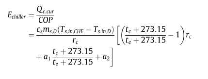
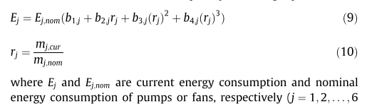
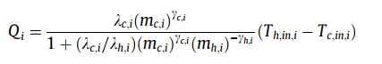
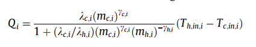
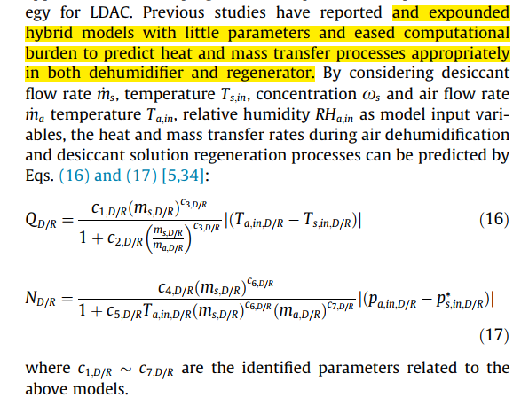

# A survey for the modeling of HVAC system.
## 1. Chiller
### 1.1 [1]
 

## 2. Pump and Fan 
### 2.1 [1]

## 3. Heat exchange model
### 3.1 [1]
  
where $T_{h,in,i}$ is the heating fluid temperature, $T_{c,in,i}$ is the cooling fluid temperature.    
  
(因为对于这种管壳式换热器，有热水侧和冷水侧)

## 4. Heat and mass transfer in dehumidifier and regenerator
### 4.1 [1]
  
Hybrid models are used.

## Reference
[1] Wang, Xinli, Wenjian Cai, and Xiaohong Yin. "A global optimized operation strategy for energy savings in liquid desiccant air conditioning using self-adaptive differential evolutionary algorithm." Applied energy 187 (2017): 410-423.