# A survey for the modeling and optimization of HVAC system.
It's a summary about the papers related with the modeling and optimization of HVAC system
## 1. Modeling
### 1.1 Dynamic of air temperature
#### Model 1[1]:   
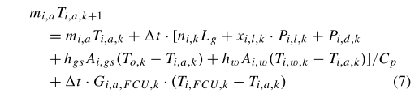  
where $n_{i,k}L_g$ is the heat generation of persons (person number = $n_{i, k}$), the next term is the heat generation of lights, $P_{i,d,k}$ is the heat generation of plug-in device, then are the heat transfer from outside environment, from other rooms and from HVAC system.  
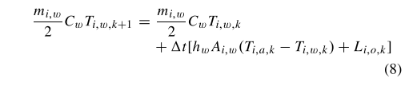  
The wall temperature is affected by the heat transfer between wall and indoor air, and the outdoor radiant heat gains.
  
__Advantages:__  
1. consider multi-room zone, and the heat interaction between different room
2. consider the occupancy
3. consider the humidity

__Drawbacks:__  
1. only consider the PCU power consumption in HVAC system
2. the uncertain factors are given (occupancy, plug-in device power)

#### Model [2]:
__control variables:__  
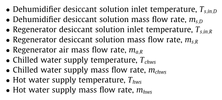
__Problem description:__  
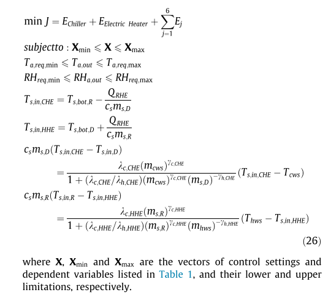  
__Advantages:__  
1. build the whole system model for LDAC system
2. consider the humidify

__Drawbacks:__  
1. it seems the optimization problem is only built for a single moment, but not the optimization for a time period
2. no uncertain factor 
3. the thermal comfort only is reflected by the temperature and humidity constraint, but not an objective

#### Model [3]:
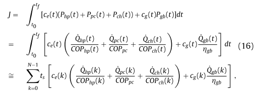  
where the $COP$ is fitted by TRANSYS data
__Advantages:__ 
1. clearly point out that the non-convex terms are the bilinear term and the fractional term.
2. use finite difference to replace the integration in the objective function. Use finite volume technique to divide the grout and soil regions into multiple thermal nodes
3. the polynomial expression can be recursively expressed as a system of bilinear equations, which the proposed method can be also handle
4. it added a contraint about the heat transfer limit
__Drawback:__  
1. no uncertainty
2. just consider the temperature
3. no thermal comfort

## 2. Optimization (control)
### 2.1 MDP-based 
#### 2.1.1 event-based policy[1]:
__State space:__
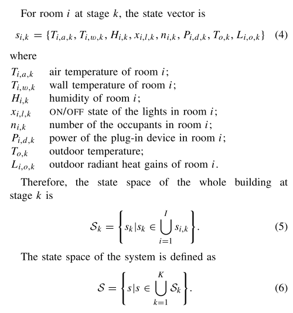
__Action space:__  
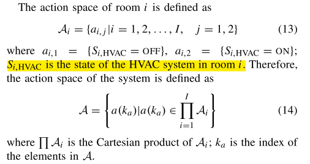
__Policy space:__  
A state-based randomized policy ds specifies a probability distribution $\gamma_{ds}(·)$ over the action space, which means that $d_s$ distribution over A.
__Event space:__  
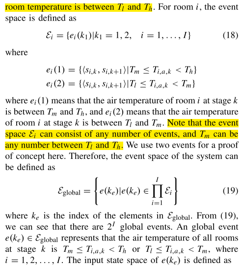  
__Input state space and output state space:__  
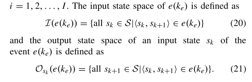  
__Algorithms:__  
1. 从event-based policy space随机选择一个initial policy $d^0$,此时$j=0$
2. 推导出derivative Formula of event-based policies (sensitivity formula)
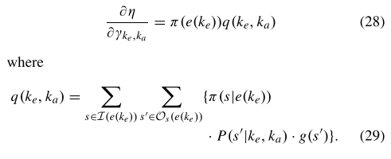  
再根据set of times instants估计上述等式右边两项的值，从而计算出上述偏微分的值。其中$\gamma_{k_e,k_a}$为当event $k_e$发生时，系统采用action $a(k_a)$的概率
3. 更新policy（其实这步就是在选择action）.  
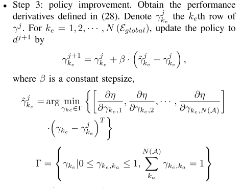 
4. 判断是否收敛（j代表迭代次数）

__Advantages:__  
1. local event-based policy can reduce the event number, which can be applied to large-scale problems.
2. local event-based policy can keep computational efficent in large-scale problem

__Drawbacks:__  
1. for MDP-based method, it can only get the 
near-optimal solution
2. it didn't give the distance between the near-optimal solution and the optimal solution.
3. only control the off/on of HVAC system in each room, but not temperature. As a result, there is no constaint for variables.

#### 2.1.2 Hamilton-Jacobi-Bellman (HJB) equation [2-5]
__Theory:__  
Details can be find in:  
1. https://person.zju.edu.cn/person/attachments/2016-12/07-1481620132-702955.pdf (proof)
2. https://zhuanlan.zhihu.com/p/58970769 (example)  

For an optimization problem like:  
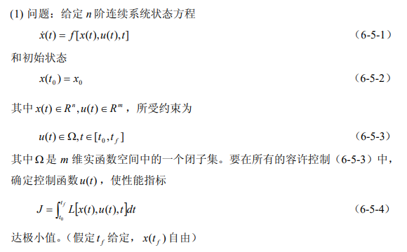  
We can get a one-order PDE of cost function J:  
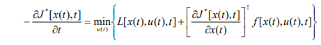  
The terms in $\min$ is regard as $H$. With the given boundary condition, we can solve the PDE and get the best control strategy (Although it is very hard to solve the PDE).  

__Application on HVAC system:__  
The object function is:  
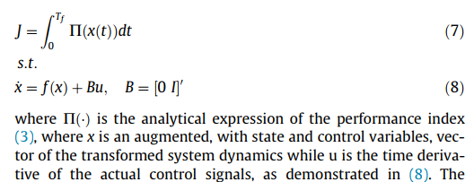  
where $\prod(x(t))=\Sigma_{i=1}^3(kE_i(t)+(1-k)C_i(t))$, $E_i(t)$ is the energy score (consumption) and $C_i(t)$ is the thermal comfort score (discomfort).  
After applying HJB equation, we get the expression of $H$:  
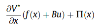  

__PCAO (Parametrized Cognitive Adaptive Optimization)__  
PCAO algothrim is introduced to solve the HJB equation in large-scale systems. PCAO parametrizes the solution of HJB equation as $V_*(x)=z'(x)Pz(x)$ and the optimal control strategy via $u^*=-\frac{1}{2}B'\frac{\partial V^*}{\partial x}$. The author used $z(x)=x$.  
So the problem of solving the HJB equation is recast as the problem of finding the matrix P (and thus the strategy u) that better approaches the solution of the HJB equation.  
The PCAO algorithm defines the close-to-optimality index (mutated for the principle of optimality):  
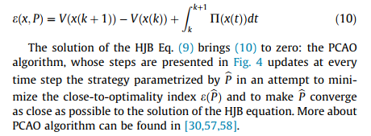  

__Algorithm (model free):__  
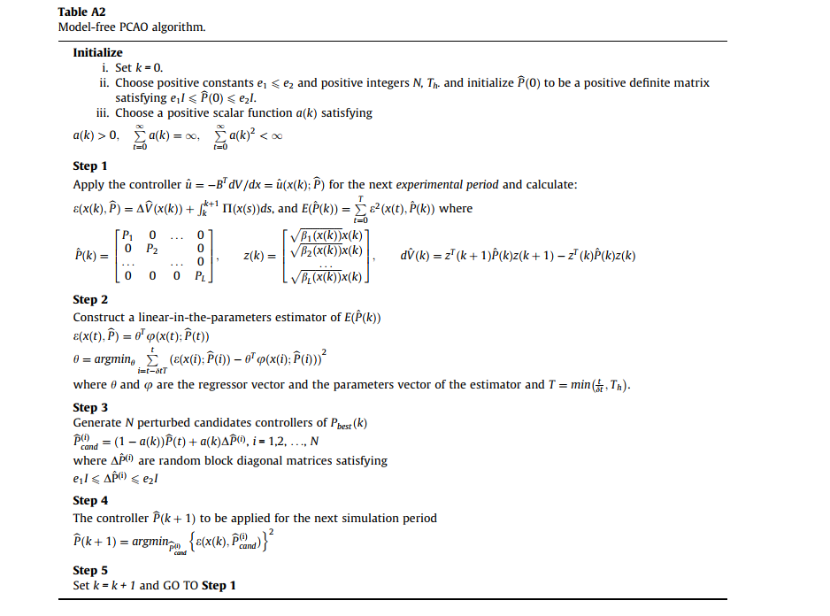 

### 2.2 EA-based (进化算法)
#### 2.2.1 Self-adaptive differential evolutionary algorithm (SADE) [6]
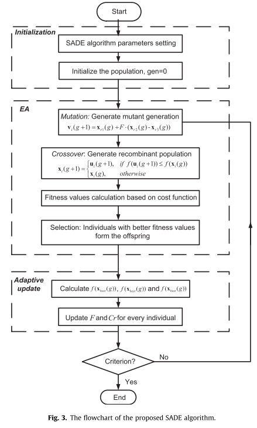  
__Advantages:__  
1. 良好的收敛性
2. easy to implement

__Drawbacks:__  
1. 方差或种群多样性在很大程度上也取决于最初的种群数量，这是 DE 的重大缺陷。另外，在处理不可分的非线性函数时可能会出现一些困难。此外，没有足够的证据表明 DE 可以有效地处理组合问题，因为可能难以离散化差分算子和定义有效的邻域
https://vlight.me/2018/04/17/differential-evolution/
2. it didn't give the distance between the near-optimal solution and the optimal solution.

### 2.3 MPC-based
#### 2.3.1 convex approach (relaxation) [7]
use convex envelope to replace the bilinear or fractional terms  
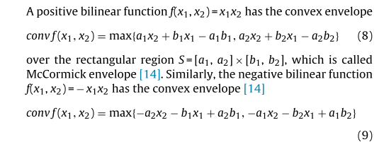 
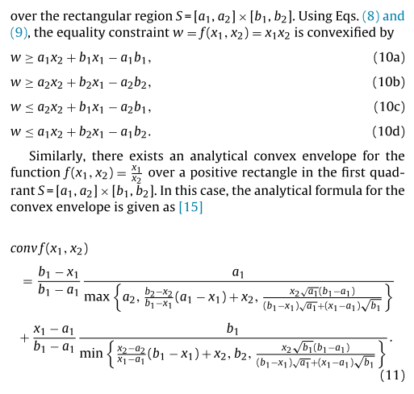
__Advantages:__  
1. it provide a simple way to convert the bilinear and fractional terms into convex term so that the original problem can be converted into a convex optimization problem
2. provide a very good solution for non-convex optimization: find the non-convex term and find a good way to relax it  

__Drawbacks:__  
1. The accuracy degree of the approximation of the original non-convex optimization problem by a convex one may be very case dependent.

## 3. Thermal comfort model [8]
### 3.1 Heat balance models
1. Predicted mean vote (PMV) and predicted percentage of dissatisfied (PPD)
### 3.2 Adaptive models

## References
[1] Wu, Zijian, Qing-Shan Jia, and Xiaohong Guan. "Optimal control of multiroom HVAC system: An event-based approach." IEEE Transactions on Control Systems Technology 24.2 (2015): 662-669.
[2] Baldi, Simone, et al. "Model-based and model-free “plug-and-play” building energy efficient control." Applied Energy 154 (2015): 829-841.
[3] Korkas, Christos D., et al. "Intelligent energy and thermal comfort management in grid-connected microgrids with heterogeneous occupancy schedule." Applied Energy 149 (2015): 194-203.
[4] Korkas, Christos D., et al. "Occupancy-based demand response and thermal comfort optimization in microgrids with renewable energy sources and energy storage." Applied Energy 163 (2016): 93-104.
[5] Michailidis, Iakovos T., et al. "Improving energy savings and thermal comfort in large-scale buildings via adaptive optimization." Control Theory: Perspectives, Applications and Developments. Nova Science Publishers, 2015. 315-335.
[6] Wang, Xinli, Wenjian Cai, and Xiaohong Yin. "A global optimized operation strategy for energy savings in liquid desiccant air conditioning using self-adaptive differential evolutionary algorithm." Applied energy 187 (2017): 410-423.
[7] Atam, Ercan, and Lieve Helsen. "A convex approach to a class of non-convex building HVAC control problems: Illustration by two case studies." Energy and Buildings 93 (2015): 269-281.
[8] Yang, Liu, Haiyan Yan, and Joseph C. Lam. "Thermal comfort and building energy consumption implications–a review." Applied energy 115 (2014): 164-173. 
