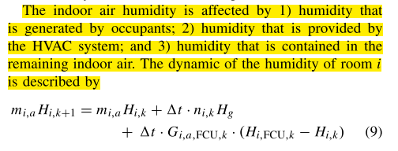
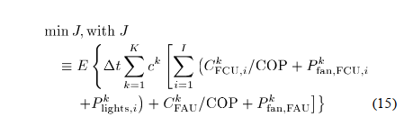
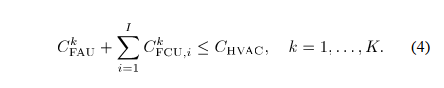
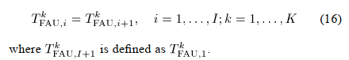
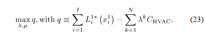
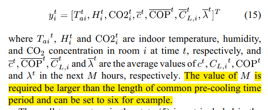
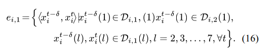
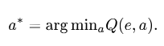

# A survey for the modeling and optimization of HVAC system.
It's a summary about the papers related with the modeling and optimization of HVAC system
## 1. Modeling
### 1.1 Dynamic of air temperature
#### Model 1[1]:   
  
where $n_{i,k}L_g$ is the heat generation of persons (person number = $n_{i, k}$), the next term is the heat generation of lights, $P_{i,d,k}$ is the heat generation of plug-in device, then are the heat transfer from outside environment, from other rooms and from HVAC system.  
  
The wall temperature is affected by the heat transfer between wall and indoor air, and the outdoor radiant heat gains.
  
__Advantages:__  
1. consider multi-room zone, and the heat interaction between different room
2. consider the occupancy
3. consider the humidity

__Drawbacks:__  
1. only consider the PCU power consumption in HVAC system
2. the uncertain factors are given (occupancy, plug-in device power)

#### Model [2]:
__control variables:__  

__Problem description:__  
  
__Advantages:__  
1. build the whole system model for LDAC system
2. consider the humidify

__Drawbacks:__  
1. it seems the optimization problem is only built for a single moment, but not the optimization for a time period
2. no uncertain factor 
3. the thermal comfort only is reflected by the temperature and humidity constraint, but not an objective

#### Model [3]:
  
where the $COP$ is fitted by TRANSYS data
__Advantages:__ 
1. clearly point out that the non-convex terms are the bilinear term and the fractional term.
2. use finite difference to replace the integration in the objective function. Use finite volume technique to divide the grout and soil regions into multiple thermal nodes
3. the polynomial expression can be recursively expressed as a system of bilinear equations, which the proposed method can be also handle
4. it added a contraint about the heat transfer limit
__Drawback:__  
1. no uncertainty
2. just consider the temperature
3. no thermal comfort

## 2. Optimization (control)
### 2.1 MDP-based 
#### 2.1.1 event-based policy[1]:
__State space:__

__Action space:__  

__Policy space:__  
A state-based randomized policy ds specifies a probability distribution $\gamma_{ds}(·)$ over the action space, which means that $d_s$ distribution over A.
__Event space:__  
  
__Input state space and output state space:__  
  
__Algorithms:__  
1. 从event-based policy space随机选择一个initial policy $d^0$,此时$j=0$
2. 推导出derivative Formula of event-based policies (sensitivity formula)
  
再根据set of times instants估计上述等式右边两项的值，从而计算出上述偏微分的值。其中$\gamma_{k_e,k_a}$为当event $k_e$发生时，系统采用action $a(k_a)$的概率
3. 更新policy（其实这步就是在选择action）.  
 
4. 判断是否收敛（j代表迭代次数） 

__Advantages:__  
1. local event-based policy can reduce the event number, which can be applied to large-scale problems.
2. local event-based policy can keep computational efficent in large-scale problem

__Drawbacks:__  
1. for MDP-based method, it can only get the 
near-optimal solution
2. it didn't give the distance between the near-optimal solution and the optimal solution.
3. only control the off/on of HVAC system in each room, but not temperature. As a result, there is no constaint for variables.

#### 2.1.2 event-based optimization with Lagrangian Relaxation Framework [2-3]
The physical model is the same with that in [1]. The __object function__ is:  
  
where the __expectation__ is over the uncertain outside temperatures and numbers of occupants. The means and variances of the uncertainties are obtained by the data.  

The __constraints__ are:  
1. The summation of cooling power of the FAU (fresh air unit) and FCUs (fan coil units) should be less than or equal to the capacity limit.

2. System physics dynamics (heat, CO2, humidity)
3. Human comfort
  

The __decision variables__ are: fresh air flow rate, FAU outlet air temperature, FCU air flow rate, and FCU outlet air temperature

__Key idea:__ In order to obtain a near-optimal solution, it divides the entire problem into subproblems each related to one room and also forms a high-level problem to coordinate all rooms.  
__Difficulty:__ This kind of methods requires the original problem to be separable. The problem is not separable because: 1) the FAU is shared by all rooms and its decision variable, $T_{FAU}^k$ FAU outlet air temperature, cannot be determined by individual rooms and 2) the FAU fan power $P_{fan,FAU}$ is nonlinear to the sum of fresh air flow rates to all rooms.  

__Solution 1 [2] (subproblem is solved by using backward stochastic dynamic programming):__  
1. Introduce new desicion variables, $T_{FAU,i}^k$ fresh air temperatures supplied by FAU to I individual rooms at time k  
2. and add some extra constraints. 

3. surrogate optimization framework [4] and Lagrangian Relaxation is used to decompose the original problem into multiple subproblems. The subproblem is:  

4. The subproblem solutions are coordinated tthrough the iterative updating of the multipliers to maximize the high-level dual function [4]:

5. Subproblem solution may be not satisfied the coupled constraints. So two heuristics have been developed. 1) If the sum of cooling power of FAU and FCUs exceeds the capacity, Use precooling to decrease the cooling demand of this time interval; 2) if the FACU fresh air temperatures required by all rooms are not the same, then ll the FAU outlet fresh air temperature is set to the minimum of the required temperatures. 

__Solution 2 [3] (subproblem is solved by using event-based approaches):__  

5. Step 1-4 are the same with that in Solution 1. The subproblem is solved by using event-based approaches. The optimal policy is nonstationary because the underlying process is nonstationary due to the nonstationary uncertainties in outside temperature and numbers of occupants, and also because the objective is a function of time-varying electricity prices. (Why? The size of the non-stationary policy space is usually extremely large, and it is time consuming to obtain the optimal policy in the nonstationary policy space)  
6. An augmented state variable is proposed to convert the non-stationary object function into stationary. The augmented state variable is:
  
Then we can define the on time-dependent event as:
 
7. Q-learning algorithm is used to find the optimal action (optimal policy)
  
Then the optimal action should be:  
 

__Advantages:__  
1. provide a way to decompose a complex problem into multiple subproblem. Very computation-effcient.
2. provide two heuristics to guarantee the solutions are feasible to the original problem. 
3. provide an augmented state variable to convert the nonstationary problem into stationary problem.

__Drawbacks:__  
1. for MDP-based method, it can only get the 
near-optimal solution
2. it didn't give the distance between the near-optimal solution and the optimal solution.
3. All elements in the state vector is discreted
4. It requierd next M hours information to keep the problem stationary

#### 2.1.2 Hamilton-Jacobi-Bellman (HJB) equation [5-8]
__Theory:__  
Details can be find in:  
1. https://person.zju.edu.cn/person/attachments/2016-12/07-1481620132-702955.pdf (proof)
2. https://zhuanlan.zhihu.com/p/58970769 (example)  

For an optimization problem like:  
  
We can get a one-order PDE of cost function J:  
  
The terms in $\min$ is regard as $H$. With the given boundary condition, we can solve the PDE and get the best control strategy (Although it is very hard to solve the PDE).  

__Application on HVAC system:__  
The object function is:  
  
where $\prod(x(t))=\Sigma_{i=1}^3(kE_i(t)+(1-k)C_i(t))$, $E_i(t)$ is the energy score (consumption) and $C_i(t)$ is the thermal comfort score (discomfort).  
After applying HJB equation, we get the expression of $H$:  
  

__PCAO (Parametrized Cognitive Adaptive Optimization)__  
PCAO algothrim is introduced to solve the HJB equation in large-scale systems. PCAO parametrizes the solution of HJB equation as $V_*(x)=z'(x)Pz(x)$ and the optimal control strategy via $u^*=-\frac{1}{2}B'\frac{\partial V^*}{\partial x}$. The author used $z(x)=x$.  
So the problem of solving the HJB equation is recast as the problem of finding the matrix P (and thus the strategy u) that better approaches the solution of the HJB equation.  
The PCAO algorithm defines the close-to-optimality index (mutated for the principle of optimality):  
  

__Algorithm (model free):__  
 

### 2.2 EA-based (进化算法)
#### 2.2.1 Self-adaptive differential evolutionary algorithm (SADE) [9]
  
__Advantages:__  
1. 良好的收敛性
2. easy to implement

__Drawbacks:__  
1. 方差或种群多样性在很大程度上也取决于最初的种群数量，这是 DE 的重大缺陷。另外，在处理不可分的非线性函数时可能会出现一些困难。此外，没有足够的证据表明 DE 可以有效地处理组合问题，因为可能难以离散化差分算子和定义有效的邻域
https://vlight.me/2018/04/17/differential-evolution/
2. it didn't give the distance between the near-optimal solution and the optimal solution.

### 2.3 MPC-based
#### 2.3.1 convex approach (relaxation) [10]
use convex envelope to replace the bilinear or fractional terms  
 

__Advantages:__  
1. it provide a simple way to convert the bilinear and fractional terms into convex term so that the original problem can be converted into a convex optimization problem
2. provide a very good solution for non-convex optimization: find the non-convex term and find a good way to relax it  

__Drawbacks:__  
1. The accuracy degree of the approximation of the original non-convex optimization problem by a convex one may be very case dependent.

## 3. Thermal comfort model [11]
### 3.1 Heat balance models
1. Predicted mean vote (PMV) and predicted percentage of dissatisfied (PPD)
### 3.2 Adaptive models

## References
[1] Wu, Zijian, Qing-Shan Jia, and Xiaohong Guan. "Optimal control of multiroom HVAC system: An event-based approach." IEEE Transactions on Control Systems Technology 24.2 (2015): 662-669.
[2] Sun, Biao, et al. "Building energy management: Integrated control of active and passive heating, cooling, lighting, shading, and ventilation systems." IEEE Transactions on automation science and engineering 10.3 (2012): 588-602.
[3] Sun, Biao, et al. "Event-based optimization within the Lagrangian relaxation framework for energy savings in HVAC systems." IEEE Transactions on Automation Science and Engineering 12.4 (2015): 1396-1406.
[4] Zhao, Xing, Peter B. Luh, and Jihua Wang. "Surrogate gradient algorithm for Lagrangian relaxation." Journal of optimization Theory and Applications 100.3 (1999): 699-712.
[5] Baldi, Simone, et al. "Model-based and model-free “plug-and-play” building energy efficient control." Applied Energy 154 (2015): 829-841.
[6] Korkas, Christos D., et al. "Intelligent energy and thermal comfort management in grid-connected microgrids with heterogeneous occupancy schedule." Applied Energy 149 (2015): 194-203.
[7] Korkas, Christos D., et al. "Occupancy-based demand response and thermal comfort optimization in microgrids with renewable energy sources and energy storage." Applied Energy 163 (2016): 93-104.
[8] Michailidis, Iakovos T., et al. "Improving energy savings and thermal comfort in large-scale buildings via adaptive optimization." Control Theory: Perspectives, Applications and Developments. Nova Science Publishers, 2015. 315-335.
[9] Wang, Xinli, Wenjian Cai, and Xiaohong Yin. "A global optimized operation strategy for energy savings in liquid desiccant air conditioning using self-adaptive differential evolutionary algorithm." Applied energy 187 (2017): 410-423.
[10] Atam, Ercan, and Lieve Helsen. "A convex approach to a class of non-convex building HVAC control problems: Illustration by two case studies." Energy and Buildings 93 (2015): 269-281.
[11] Yang, Liu, Haiyan Yan, and Joseph C. Lam. "Thermal comfort and building energy consumption implications–a review." Applied energy 115 (2014): 164-173. 

