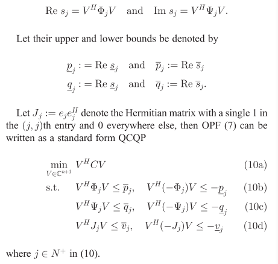

# Notes for Paper 3
### Title:Convex relaxation of optimal power flow—Part I: Formulations and equivalence 
### Authors:Low S H.
### Journal:IEEE Transactions on Control of Network Systems 
### Tags: Convex relaxation; optimal power flow; power system; QCQP; SOCP; SDP
### 0. Summary

### 1. Power flow models
#### 1.1 Bus injection model
$$
I_{jk} = y_{jk}(V_j-V_k)\\
s_j=\sum_{k:j\sim k}y^H_{jk}V_j(V^H_j-V^H_k), j \in N^+
$$
where superscript $H$ refers the conjugate transpose, $s_j$ is the power flow on node j, $j\sim k$ refers that node j is connected with node k.  
Bus 0 is the slack bus, which voltage is fixed and we assume that $V_0=1\angle0^\circ$; $s_j$ is the net complex power injection at bus $j \in N^+$.  
So, the solution for the power flow model $V \in C^{n+1}$, where $C$ is the complex numbers.  

##### Bus type    
1. slack bus. $V_0$ is given, $s_0$ is variable.
2. generator bus. $Re(s_j)=p_j$ and $|V_j|$ are known, $Im(s_j)=q_j$ and $\angle V_j$ are unknown.
3. load bus. $s_j$ is specified and $V_j$ is variable.

__Each bus is characterized by two complex variables $V_j$ and $s_j$ (or four real variables)__. As described above, two variables will be given at each bus (slack, generator, load), then we can solve the $n+1$ complex equations, or $2(n+1)$ real number equations, to get the remaining $2(n+1)$ variables.

#### 1.2 Branch Flow Model
$$
\sum_{k: j\rightarrow k}S_{jk}=\sum_{i: i\rightarrow j}(S_{ij}-z_{ij}|I_{ij}|^2)+s_j, j\in N^+ \\
I_{ij} = y_{jk}(V_j-V_k), j \rightarrow k \in \widetilde{E} \\
S_{jk}=V_jI^H_{jk}, j \rightarrow k \in \widetilde{E}
$$
The solution $\widetilde{x}:=(S,I,V) \in C^{2m+n+1}$, where $m$ is the number of directed edges, $s_j$ is the net complex power injection at bus $j$. The total equation number is $(n+1)+m+m=2m+n+1$, so the equation group is closed.

### 2. convert OPF into QCQP
Let $I_j$ be the net injection current from bus j to the rest of the network:
$$I_j=\sum_{k:j \sim k}y_{ik}(V_k-V_j)$$
Then we can construct a sysmmetric matrice to let $I=YV$:
$$Y_{ij} = \begin{cases}  
\sum_{k:k \sim i} y_{ik}, & if \quad i = j \\
-y_{ij} & if \quad i \neq j \quad and \quad i \sim j \\
0, & otherwise.
\end{cases}$$
so BIM is equivalent to:
$$s_j=V_jI^H_j=(e^H_jV)(I^He_j)$$ where e_j is the $(n+1)$ dimensional vector with 1 in the jth entry and 0 elsewhere. Because $sj$ is scalar variable, we have 
$$s_j=tr(s_j)=tr(e^H_j V V^H Y^H e_j)$$
Because the shape of $e^H_j V V^H$ is the same with that of $(Y^H e_j)^T$, we have
$$s_j=tr(e^H_j V V^H Y^H e_j)=tr(Y^H e_j e^H_j V V^H)$$
Then we have (__why?__)
$$s_j=tr(Y^H e_j e^H_j V V^H)=tr(Y^H e_j e^H_j)VV^H=V^H Y^H_j V$$
where $Y_j:=e_j e^H_jY$  
Then
$$
Re(s_j)=1/2V^H(Y^H_j+Y_j)V\\
Im(s_j)=1/(2i)V^H(Y^H_j-Y_j)V\\
$$

