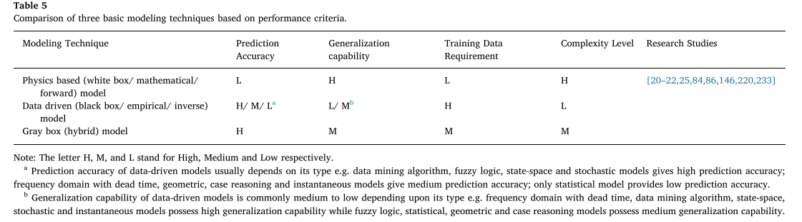

# Notes for Paper 4
### Title:Modeling techniques used in building HVAC control systems: A review 
### Authors:Afroz, Zakia, Shafiullah, G. M. Urmee, Tania Higgins, Gary
### Journal:Renewable and Sustainable Energy Reviews 
### Tags: Building; Control system; Energy consumption; HVAC; Indoor air quality; Modeling technique; Thermal comfort

### 0. Summary
This paper presents critical review of current modeling techniques used in HVAC systems regarding their applicability and ease of accep- tance in practice and summarizes the strengths, weaknesses, applications and performance of these modeling techniques. Additionally, the performance and outcome of some of the developed models used in real world HVAC systems have been discussed.

### 1. Classification of HVAC modeling techniques
HVAC modeling techniques can be divided into three categories: physics-based (or white box/mathematical/forward), data-driven (or black box/empirical/inverse), and gray box (or hybrid). 
### 2. Physics-based model
Examples of physics-based model include: chiller model [60,65–71], cooling tower model, zone model [54,72–75], AHU model, mixing box model [54,72,74], splitting box model [72], heating/ cooling coil model [54,72,73,75–80], humidifier model [54], fan or pump model [54,72,73,75], duct model [54], sensor model [54], damper or valve model [72], etc.
#### 2.1 Chiller model
The chiller is a primary system component of an HVAC system that
rejects heat from a liquid through a vapor compression cycle or an absorption cooling cycle [91].
A chiller comprises four elementary com- ponents: evaporator, condenser, compressor, and expansion valve. 
The chiller power consumption differs based on the water flow rate,the heat capacity of water, the temperature difference between in- coming and outgoing water in a chilled water loop and the Coefficient of Performance (COP) of the chiller [94].  

#### 2.2 Zone model
An HVAC zone can be defined as a cluster of adjacent offices and/ or spaces often covered by a common air-handling unit (AHU) or air terminal device [97].   

#### 2.3 The heating and cooling coil model
Heating and cooling coils are another essential element of HVAC systems. In the AHU, heating and cooling coil act as heat exchangers where air loses or gains heat from water passing through the coil.  

#### 2.4 Cooling tower model
A cooling tower working as a primary system component of HVAC system performs the function of heat rejection from the chiller con- denser [99].  

### 3. Data-driven model

#### 3.1 Frequency domain model
There are some processes (e.g., dynamics of zone temperature and humidity) in the HVAC system that are known as slow moving due to the substantial thermal inertia of the system. Such processes can be modeled using the first and second order (over-damped) models with dead time [132–135] e.g.
These models are only applied for linear and time-in- variant (LTI) systems. Thus complicated and time-varying system dy- namics cannot be represented with such models [20].

#### 3.2 Data mining algorithms
ANN has been widely used in HVAC system dynamics modeling, prediction, control and optimization [8,44,84,87,88,139–169]. 
__Drawbacks of data mining algorithms:__
for both types of data mining algorithms, no physical inter- pretation of the developed model is possible [20,22] and the perfor- mance degrades when conditions deviate from training and testing conditions [20]. Moreover, these algorithms are suitable for offline model development whereas online implementation of these algorithms is often cumbersome [20].

#### 3.3 Fuzzy logic model
The development of fuzzy logic (FL) models involves the im- plementation of the if-then-else statements whose rules are expressed in the form of a table or database [184]. 
__Drawbacks__: However, as FL incorporates the operator's ex- perience in model design, operators must have comprehensive knowl- edge of plant and its various operating states. Moreover, FL model development requires a large amount of performance data for training T–S, FAN, and ANFIS [22]. 

#### 3.4 Statistical model
__Advantages:__ Statistical models possess certain advantages such as requiring short calculation time, working well under time varying process noise, scope of the model development with limited data.  
__Drawbacks:__ low accuracy, inability to capture the nonlinear dynamics of the system which limits the application of these types of model in HVAC system limited [20,22].  
__Features:__ First, any temporal, physical or architectural changes of a building have an impact upon space temperature, and this ultimately affects input and output variables of the model [42,191,205]. Second, optimum structure and order of the model are often determined through extensive numerical simulations [37,42,205]. Third, there is a risk of increasing the prediction error of the model rapidly in case the prediction prolongs over a lengthier time interval [42,191,193]. Fourth, despite very few researchers built their models using long-period data collected from real buildings [42,205,206], most statistical models are trained using either simulation data or limited measurements from a small quantity of HVAC components [37,191,193].
#### 3.5 State Space model
__Advantages:__ 
This type of model requires a short time to tune and can be effort-lessly extended to MIMO systems [20].  
In addition, it reflects the relationship between the input and the output variables in the model in a very clear way and above all, the model can be expressed in the form of a matrix that is convenient for computer calculation [210].  
It was concluded by this study that this model can be applied for fast predictions of dynamic characteristics of the key parameters, finding control rules and designing good control system for the refrigeration system, and for developing a dynamic re- sponse toolbox for chillers.  
__Drawbacks:__ the input of the system might not excite the system on satisfactory number of fre- quencies [211], some key feature or characteristics of the physical es- sence of the system might be lost in data, and natural character of the data might create substantial statistical problem [153].

#### 3.6 Stochastic model
Stochastic models can deal with the random processes of the HVAC systems that act as random variables, and these processes can be modeled using the probability density functions (PDF) [20,22]. Ex- amples of Stochastic model include simulation of occupants’ time schedules and activity level [217,218].  
__Advantages:__  
One of the important features of stochastic model is the versatility of its application to many physical processes that can be approximated to standard normal and uniform distributions although a large amount of data is a prerequisite for that [20,22]. Moreover, the model cannot provide accurate predictions if the probability density functions (PDF) is not modeled properly [20,22].

### 4. Gray-box model
The gray box models which can be regarded as the combination of white box and black box models. The basic structure of the model is formed from physics-based methods while the model parameters are determined by using the parameter estimation algorithms on the measured data of the system. This approach is especially beneficial for control applications when the model is expressed in a suitable form such as transfer function or state space [90].  
__See Table 3__

### 5. Comparison
#### 5.1 Physics-based model 
__Advantages:__   
ease of analysis, robust generalization capability and requirement of less training data.  
__Drawbacks:__  
1. Some of the models provided very poor prediction accuracy due to the involvement of excess numbers of assumptions. As a result, the resulting design did not perform in accordance with the model.
2. Some of the models can be expressed as insufficient because of not taking into account some important parameters or operating conditions with respect to those models. On the other hand, some models have been developed considering all necessary physical parameters and operating conditions. As a result, the dynamic relationship between the system and the ambient disturbances were better identified by these models, and provided much more information about the system dynamic behaviors. However, while executing, those models were found too complex to be implemented in real-time, affordable systems.
3. Most of the developed models were SISO type which is unable to represent the multivariable interactions in HVAC system.
4. Some of the models were found steady-state or quasi-steady-state which is not suitable for handling high-frequency disturbances and dealing various HVAC design problems.
#### 5.2 Black-box model
__Advantages:__   
Black box modeling technique can provide high accuracy, and also its simple structure makes them applicable for real-time operation and control.  
__Drawbacks:__  
1. To avoid complicacy within the model some key parameters or operating conditions were not considered in some models.
2. Many models have been developed considering the whole building a single zone to avoid the phenomena of thermal interaction among adjacent zones.
3. It is hard to achieve good prediction accuracy using statistical model in HVAC system or building indoor air quality control although this type of model has performed successfully to describe the greenhouse behavior during most of the year. Furthermore, using a limited range of data in model development is not reliable to predict e.g., indoor temperature, relative humidity, etc.
4. In some cases the model has not been validated by applying in a real system.
5. The identification process using the subspace state-space method may lack the persistence of the excitation or the excitation itself.
6. The model describing the dynamic characteristics of the building can be considered incomplete when seasonal variation is not covered by the data.
Gray-box/hybrid

#### 5.3 Gray-box/hybrid model
__Advantages:__  
high accuracy, easy generalization capability, less complexity and low computational cost and ultimately, can deliver good control performance.  
__Drawbacks:__  
1. Some of the models were developed based on some assumptions which are not achievable in real system.
2. Some of the models can be considered as incomplete because tar- geted at simplification some of the important factors e.g. variation in occupancy level, heat transfer among adjacent zones etc. of in- door thermal comfort were not taken into account during model development.
3. Sometimes the model does not hold the flexibility to use in other HVAC systems.

### 6. Recommendation
#### 6.1 Physics-based model
1. While developing physics-based models attention should be given on using least numbers of assumptions.
2. The physics-based model should be simplified or detailed based on the objective of any research studies. However, important para- meters or operating conditions that have major impacts on the performance of that model should not be overlooked.
3. The models for HVAC system should be MIMO type especially the zone model so that it can handle the dynamic thermal processes within the zones and the interaction with the environment because of the continuous variation of the external and internal environment of the zone.
4. The developed model must be applicable and relate with the concept of efficient running of HVAC components in real system.
#### 6.2 Data-driven model
1. During model development, relevant important parameters and operating conditions must be taken into account.
2. While developing model for multi-zone building, the model should not be simplified to single zone to ignore the effect of thermal interaction among adjacent zones.
3. A statistical model is not suitable where high prediction accuracy is required.
4. The proposed model should be validated by a real system. 
5. This study also aligns with the statement drawn by Prívara et al. [213] that is the drawback of state space model can be possibly overcome by generating artificial data that already contains desired properties.
6. It is very important to cover the seasonal variation by the data while developing any model that represents building dynamic conditions.
7. Among different types of data-driven modeling technique appro- priate model should be selected based on their features and ease of application. It is also important to choose between linear and non- linear depending on the purpose of the model. For example, to es- timate the thermal parameters of physical models linear parametric models can be used while for getting an adequate description of the thermal characteristics nonlinear model is required.
#### 6.3 Hybrid model
1. The developed model must be free from any assumptions that may lead the model to uncertainty to implement in real system.
2. Since the ultimate objective of HVAC system is to provide thermal comfort, therefore during model development the important factors of thermal comfort must not be overlooked.
3. The model must be adaptive in real system. 4. During model development recent energy conservation strategies and advanced controllers of HVAC system should be integrated.

### Appendix.A: valuable references
1. Benefits of optimization in HVAC System [4]
2. Requirements for HVAC control system [19]
3. Several review articles have been published so far on modeling techniques [20–23], control strategies [24–27] and optimization methods [27] of HVAC systems. 
4. A comprehensive review of intelligent control techniques used in HVAC systems was provided by Mirinejad et al. [31].
5. Disturbances in HVAC system [61-62]
6. Occupants: Page et al. [218] represented the influence of occupants on the building by stochastic models which emphasized on occupants’ time schedule and their interacting level with their indoor environment. Sun et al. [217] developed a stochastic model for overtime occupancy based on measured occupancy data from an office building which shows that this model can be used to generate occupant schedules during overtime as an input to building energy simulations.