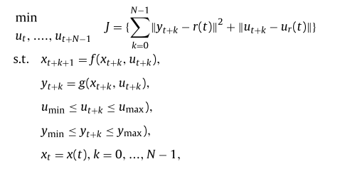
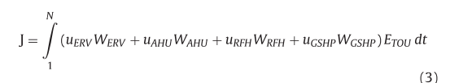
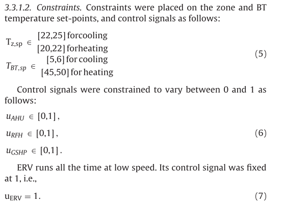

# Notes for Paper 6
### Title:Artificial neural network (ANN) based model predictive control (MPC) and optimization of HVAC systems: A state of the art review and case study of a residential HVAC system
### Authors: Abdul Aframa, Farrokh Janabi-Sharifi, Alan S. Fung, Kaamran Raahemifar
### Journal: Energy and Buildings
### Tags: ANN based MPC review; Artificial neural network (ANN); Model predictive control (MPC); Optimization of HVAC system; Residential HVAC system

### 1. Supervisory MPC
#### 1.1 Advantages of Supervisory MPC
It can automatically take into account the variations in weather parameters over a future horizon and control the appropriate settings of HVAC systems, and it can take into account the dynamic electricity price and adjust the set-points of local level controllers for active and passive ther- mal energy storage to offset the peak load to off-peak hours.
#### 1.2 Inverse or data-driven models
Inverse models can be developed comparatively easily since they do not require the understanding of system physics.  
the ease of development of inverse models comes at the cost of reduced generalization capability compared to the forward models.

### 2. Control Objective
1. Minimize energy consumption [6,7,33–35,10,11,39,40] (If electricity price changes during the day, it is more beneficial to minimize the operating cost of the HVAC system compared to minimizing the energy consumption)
2. Maintain thermal comfort [6,33–35,10,11] (Thermal comfort is calculated using the predicted mean vote (PMV) index)
3. Maintain indoor air quality (IAQ) at acceptable level [9]
4. Minimize operating cost [10,41,7,42,30]
5. Maintain visual comfort at acceptable level [11]
6. Minimize retrofit cost [38]
7. Minimize thermal discomfort hours [38].

### 3. Modeling data
#### 3.1 Building energy consumption data
Data can be measured from the site under normal operation or under special data gathering test conditions by applying the pseudo-random binary sequence (PRBS) at the controlled inputs. Data can also be generated from the building energy simulation programs such as Transient System Simulation Tool (TRNSYS) and EnergyPlus Energy Simulation Software
#### 3.2 weather parameters
Using the prediction models or downloaded from government servers where available. 
#### 3.3 Occupancy
Occupancy can be forecasted using schedules and can be measured using occupancy sensors such as passive infrared (PIR) sensors. Occupancy can also be estimated through the CO2 generation rate in the indoor space.
#### 3.4 Electricity price
Variable electricity price is generally known in advance.

### 4. ANN architecture
#### 4.1 Types of ANN
The following types of ANN were used for ANN-MPC developments for HVAC systems:
1. MLP [34,31,10,11,38,40]
2. MLP ensemble [8,9,33,35]
3. Radial basis function (RBF) ANN [6]
4. Nonlinear auto-regressive model with exogenous input (NARX) [7,32,37]
5. RBFs used as NARX [30]
6. Feedforward multi-layer self-growing ANN [10]
7. Artificial Neuro-Fuzzy Inference System (ANFIS) [39].
#### 4.2 Cost function and performance
Mean squared error (MSE) or root mean squared error (RMSE). Performance of ANN against mea- sured data is analyzed using absolute error (AE), mean absolute error (MAE) [6,8], maximum absolute error (maxAE) [6], normalized relative mean squared error (NRMSE) fitness [32], mean absolute percentage error (MAPE) [8], standard deviation of absolute error (StdAE) [8], standard deviation of absolute percentage error (StdAPE) [8], MSE [37], RMSE [7] and linear correlation coefficient [37].
#### 4.3 Activation function
Commonly used types of activation functions include sigmoidal, hyperbolic, RBF and linear. Compared to MLP; RBF ANN does not suffer from local minima.
#### 4.4 ANN architecture parameter
ANN architecture (number of neurons in input, output and hidden layers) is generally identified based on trial and error [38,40], suggestion in previous empirical studies [37], chosen randomly [34,35], forward selection method [32], or automatic identification method [6,30,10,11].  
choose the number of hidden layer neurons appropriately either manually or using an automatic architecture selection algorithm such as cascade-correlation algorithm and multi-objective genetic algorithm (MOGA).

### 5. Optimization method
for nonlinear systems numerical techniques, such as dynamic programming and gradient methods have to be employed. 
1. GA [10,11]
2. Modified GA or MOGA [39,38]
3. Newton-Raphson method [37]
4. Interior-point method [34]
5. Branch and bound (BaB) method [6,30]
6. Particle swarm optimization (PSO) algorithm [8,31]
7. Modified or multi-objective PSO (MOPSO) [35]8. Strength Pareto evolutionary algorithm (SPEA) [31]
8. SPEA with local search (SPEA-LS) [9]
9. Strength MOPSO (S-MOPSO) algorithm [9]
10. Firefly algorithm [36]
11. Harmony search [31].

### 6. Supervisory MPC
MPC generates the set-points of local level controllers in order to store energy in building mass during off-peak hours and reduce equipment use during mid-peak and peak price hours.  
Cost function can take the form of tracking error, control effort, energy cost, demand cost, power consumption, or a combination of these factors.  
Constraints can be placed on the rate and range limits of actuators and manipulated variables (e.g., upper and lower limits of zone temperature, supply air flow rate limits, and range and speed limits for damper positioning).  
This effort results in a controller that is robust to both time-varying disturbances and system parameters and regulates the process tightly within given bounds.  
__Problems:__  
  
__Cost function:__  
  
__Constraints:__  
  
