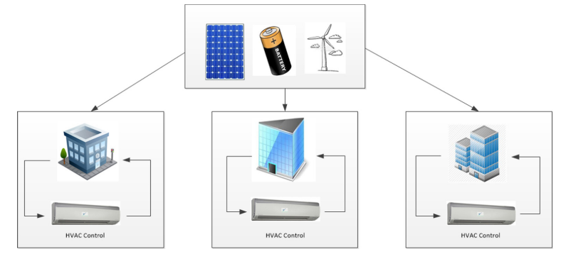
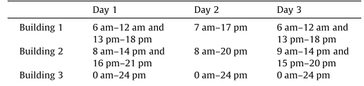
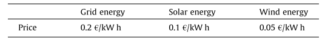
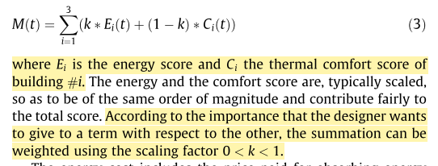
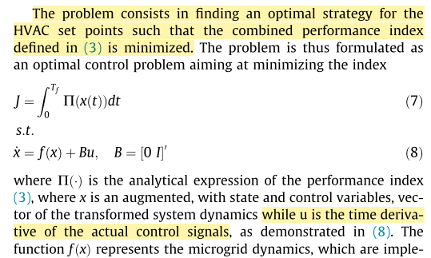
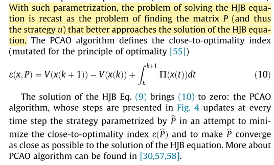

# Notes for Paper 7
### Title: Occupancy-based demand response and thermal comfort optimization in microgrids with renewable energy sources and energy storage
### Authors: Christos D. Korkas, Simone Baldi, Iakovos Michailidis, Elias B. Kosmatopoulos
### Journal: Applied Energy (2015)
### Tags: Occupancy; demand response; thermal comfort; energy storage

### 0. Summary
#### 0.1 Achievements
This paper presents a control algorithm for joint demand response management and thermal comfort optimization with renewable energy sources and energy storage units. A two-level supervisory closed-loop feedback strategy is used to achieve the large-scale nature and robustness.
#### 0.2 Drawbacks
1. There is no description about how to calculate the energy score and thermal comfort score in this paper. Also this paper didn't tell us how to choose the scaling factor.
2. The thermal demand is given.
3. The occupancy schedule is given. In fact, it should be unknown and it is better to be treated as a random variable.
#### 0.3 Useful points
1. The way to consider renewable energy sources and energy storage
2. The way to implement large-scale optimization: local control for one building, then a central control is employed.
### 1. System description
#### 1.1 Whole system structure

#### 1.2 Occupancy schedule (given)

#### 1.3 Energy prices (given)

#### 1.4 Photovoltaic generation [49]
$P_s=\eta SI_a(1-0.005(T_{amd}-25))[kWh]$
#### 1.5 Wind turbine generation [50]
$P_M = 1/2 \rho \pi R^2V^3C_p(\lambda, \beta)[kWh]$

### 2. Objective function

The thermal comfort cost is developed by Fanger[9]
$$
PPD = 100-95e^{-(0.03353PMV^4+0.2179PMV^2)}
$$
Violation of this bounds are accepted but only over short periods of time.
### 3. Control strategy

By using Hamilton–Jacobi–Bellman (HJB) equation:  

