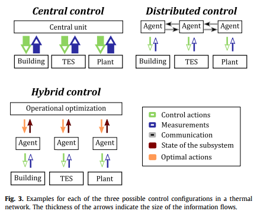

# Notes for Paper 8
### Title: Controlling district heating and cooling networks to unlock flexibility: A review
### Authors: Vandermeulen, Annelies, Bram van der Heijde, and Lieve Helsen.
### Journal: Energy  (2018)
### Tags: District heating; District cooling; Thermal networks; Control; Flexibility; Thermal energy storage

### 0. Summary
this paper presents a possible definition of flexibility and its sources in a thermal network. It reviews techniques to quantify flexibility and shows the need for a more advanced control strategy; moreover, it discusses the challenges involved in developing such a control strategy. Also, the literature on advanced control in thermal networks is reviewed, by making a distinction between central, distributed and hybrid control. Finally, possible future research topics are identified based on the findings.

### 1. Flexibility in thermal networks
A possible definition of flexibility is the ability to speed up or delay the injection or extraction of energy into or from a system. 
In thermal networks, thermal capacity serves as a source of thermal inertia. Three types of thermal capacity
1. The heat or cold carrier fluid,
2. Thermal storage devices and
3. The thermal inertia of the buildings to which heat or cold is supplied.
The first and last inertia categories, they are unable to store heat or cold over long time periods and are typically used for intra-day balancing.  
Depending on the size of the storage device and the technology used, this second type of inertia may in addition be used for long-term storage.  
#### 1.1 Network storage
A limited amount of heat or cold can be stored temporarily by raising or lowering the temperature of the water in the thermal network.
#### 1.2 Storage in dedicated devices
Thermal energy storage systems are used in district heating and cooling systems for a number of reasons, among which are peak shaving, Security of Supply and cost optimization. Most systems rely on sensible heat storage (typically hot water tanks) for diurnal use.  
Instead of centrally located large thermal storage units, flexibility also emanates from smaller storage tanks dispersed over the network.
#### 1.3 Building inertia
The potential for flexible use of building inertia (also including the effect of thermal energy storage in a water buffer) on a country-wide scale.

#### 1.4 Quantification of flexibility
Van der Heijde et al. [36] adapted the method of Stinner et al. such that it can also be applied to linear dynamic building models using an optimal control problem.   
De Coninck and Helsen [37] quantified the flexibility in terms of the extra cost of shifting the energy use in time,thus arriving at a cost curve for flexibility as a function of the activated flexibility volume. The advantage is that these curves can be aggregated for multiple buildings.
__研究点：储热系统储热再释放会造成能量损失（熵增），但使用储热系统可以减少高峰时期用电（高峰期电价高），因此，综合考虑储热系统的损失和收益，结合HVAC系统，可以进行优化策略的研究__

### 2. Motivation of advanced control in thermal networks
1. Distributing heat or cold fairly,
2. Peak shaving and valley filling,
3. Optimizing the operation of heat or cold generation plants,
4. Providing ancillary services,
5. Enabling low energy districts,
6. Enabling low supply temperatures, and
7. Assisting the transition to a 100% RES energy system

### 3. Overview of controllers in thermal netwworks

#### 3.1 Central control
Lesko and Bujalski [69] developed operational optimization of a district heating network but focused on thermal load shifting by using the thermal inertia of buildings.    
In operational optimization of thermal networks, the optimization problem is a mixed integer non-linear problem (MINLP).  
Ikonen et al. [71] used permutational invariance to simplify the optimization problem and Runvik et al. [72] split the optimization in two sub-optimizations, both of which have efficient solvers.

#### 3.2 Distributed control

#### 3.3 Hybrid control
A first example of a hybrid controller was presented by Johansson and Wernstedt [29]. an operational optimization is solved to determine the heat load that maximizes profits. The optimal load profile and its value (i.e. the profit that can be made by using it) is then passed on to the producer agents who try to sell it to the building agents.  
Another example of hybrid control is the one developed by Bünning et al. [82]. They present a multi-agent controller for a low temperature district heating and cooling network that includes a central supply temperature optimization. The agents representing the heat or cold generation divide the required heat/cold capacity amongst themselves, keeping the both the warm and cold line at a sufficiently high/low temperature.

#### 3.4 Comparison
Central control: take the dynamics of the network into account  
multiagent system: suited for the large, modular and changeable thermal networks.  
hybrid controller:  
1. This results in a controller that can cope with both the large, changeable and modular thermal network and its dynamics.
2. through the use of agents, who monitor the subsystems, the quality of service to the customers can be guaranteed.
3. the central operational optimization (present in both the central and hybrid configuration) can be simplified by using an aggregated model of the thermal network.

