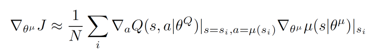
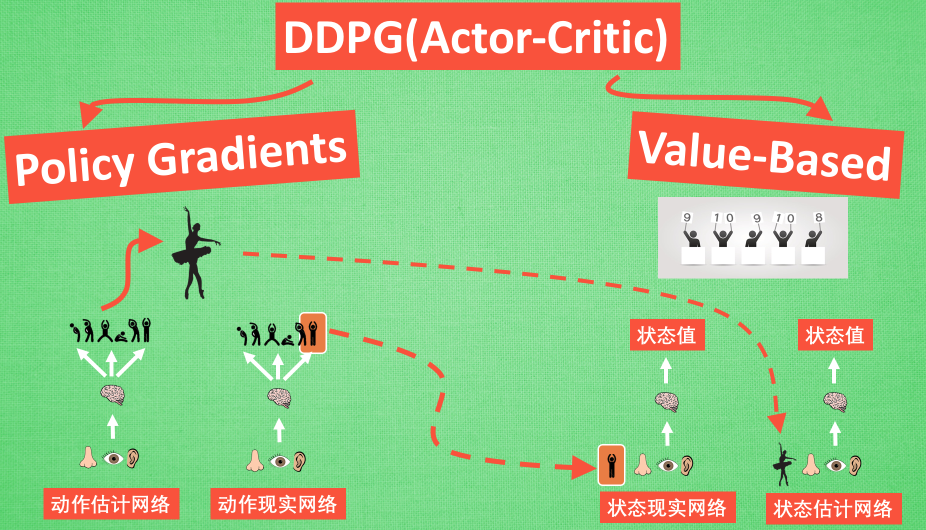
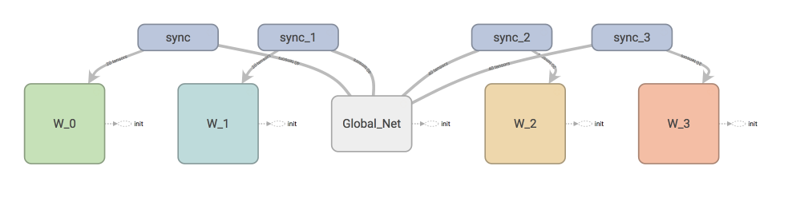

# Reinforcement Learning Introduction
## It is the notes of Reinforcement learning tutorials provided by Morvan Zhou.
The tutorials link is:  
https://morvanzhou.github.io/tutorials/machine-learning/reinforcement-learning/

### 1. What is RL?
__从无到有:__ 计算机在不断尝试中更新自己的行为准则. Computer will update its behavior standard by keeping trying.  
__虚拟老师:__ just grade the action but don't tell you how to do. The action data with score is something like the samples with labels in supervised learning.
### 2. Classification of RL algorithms
#### 2.1 Model free or Model based
##### Model free
__Description:__ This kind of model will not build a model to represent the environment, so the machine can only wait the feedback from true environment then detemine what should do at next step.  
__algorithms:__ Q learning, Sarsa, Policy Gradients.
##### Modek based
__Description:__ The machine will build a model to silumate the feedback from true environment according to the previous data. It can image all possible scenarios in the next step, then choose the best action from all choices.
__algorithms:__ Add a program to build the model to describe the environment.

#### 2.2 Policy-based or Value-based
##### Policy-based(基于概率)
The machine will output the policy of each action, and take actions based on the policy, so every action may be chosen. It can deal with the problem with both discrete and continuous actions.

##### Value-based
The machine will output all the value (score) for each next action, then choose the best action with highest value. It can only handle the problem with discrete actions.

#### 2.3 Monte-Carlo update or Temporal-difference update
__Monte-Carlo update:__ summarize all the turning points after the whole game over.  Monte-carlo learning and basic policy gradients are belongs to this kind of RL.  
__Temporal-difference update:__ update the standards on each step, so it is more efficient. Q learning, Sarsa, upgraded policy gradients are belongs to this kind of RL.

#### 2.4 On-Policy or Off-Policy
__On-Policy:__ The machine must play the game and generate the data by itself. Examples: Sarsa, Sarsa lambda.  
__Off-Policy:__ The machine can use others' experiences to update its own standards. Examples: Q learning, Deep-Q-Network.

### 3. Q learning
A simple example to introduce Q learning:
https://www.zhihu.com/question/26408259/answer/123230350
#### 3.1 Algorithm

Q is action-utility function. $s$ represents the step, $a$ stands for the action. The superscript $'$ refers to the new step.  
$\epsilon-greedy$: the probability of choosing the best action is $\epsilon$. In other words, the probability to randomly choose action is $1-\epsilon$. (It is used to get out from the local optimal).  
$\gamma$ is the discount factor. It has the effect of valuing rewards received earlier higher than those received later.  
$\alpha$ is the learning rate, it determinies to what extent newly acquired information overrides old information.

Though we use $\max_{a'} Q(s',a')$ to estimate the score on $(s',a')$, __but the machine does not do anything, the action on $s'$ will be determined after updating the Q table__.  
_**Note**: Only when the machine get the reward, can the Q table be updated according to the $Q(s,a)$ update formulation._

#### 3.2 algorithm implement
A simple example of Q learning (maze): https://github.com/MorvanZhou/Reinforcement-learning-with-tensorflow/tree/master/contents/2_Q_Learning_maze  

A typical code construction:  
__Part I: Q learning Table__  
```python
class QLearningTable:
    # initialization
    def __init__(self, actions, learning_rate=0.01, reward_decay=0.9, e_greedy=0.9):

    # choose next action for next step
    def choose_action(self, observation):

    # update Q table
    def learn(self, s, a, r, s_):

    # check whether the state exists in Q table
    def check_state_exist(self, state):
```

__Part II: update__
```python
def update():
    for episode in range(100):
        # initial observation
        observation = env.reset()

        while True:
            # fresh env
            env.render()

            # RL choose action based on observation
            action = RL.choose_action(str(observation))

            # RL take action and get next observation and reward
            observation_, reward, done = env.step(action)

            # RL learn from this transition
            RL.learn(str(observation), action, reward, str(observation_))

            # swap observation
            observation = observation_

            # break while loop when end of this episode
            if done:
                break

    # end of game
    print('game over')
    env.destroy()
```

__Part III: environment__  
Determine the reward function and the environment feedback.

### 4. Sarsa
Sarsa is very similar with Q learning.
#### 4.1 Algorithm

Sarsa will choose $a'$ from $s$ and take the action. Then the max term in update formulation is converted into $Q(s',a')$, which is really taken by the machine.
#### 4.2 Algorithm implement
__Part I: SarsaTable__
```python
class SarsaTable:
    # initialization (same with Q learning)
    def __init__(self, actions, learning_rate=0.01, reward_decay=0.9, e_greedy=0.9):

    # choose next action for next step (same with Q learning)
    def choose_action(self, observation):

    # update Sarsatable (differ from that in Q learning)
    def learn(self, s, a, r, s_):

    # check whether the state exists in Sarsa table (same with Q learning)
    def check_state_exist(self, state):
```
__Part II: Update__
```python
def update():
    for episode in range(100):
        # initial observation
        observation = env.reset()

        # RL choose action based on observation
        action = RL.choose_action(str(observation))

        while True:
            # fresh env
            env.render()

            # RL take action and get next observation and reward
            observation_, reward, done = env.step(action)

            # RL choose action based on next observation (differ from Q learning)
            action_ = RL.choose_action(str(observation_))

            # RL learn from this transition (s, a, r, s, a) ==> Sarsa
            RL.learn(str(observation), action, reward, str(observation_), action_)

            # swap observation and action
            observation = observation_
            action = action_

            # break while loop when end of this episode
            if done:
                break

    # end of game
    print('game over')
    env.destroy()
```
#### 4.3 Accelerate convergence: Sarsa($\lambda$)
__Algorithm:__

Another table __eligibility trace $E(s,a)$__ is involved. It is used to record the whole trace of machine from the start point to the terminal.  
The q table is still updated in each step episode, but unlike the normal Sarsa which only updates the last state $(s,a)$, Sarsa($\lambda$) will __update all the passed states__.  
$\lambda$ is the decay factor of trace ($\gamma$ is the decay factor of reward).  
For example, if the machine reaches to the termial at $s_n$, then the $E(s_{n-1}, a_{n-1})$ will only multiply with $\lambda$, while the $E(s_{n-2}, a_{n-2})$ will multiply with $\lambda^2$, because it has already multiplied with $\lambda$ at $s=s_{n-1}$.  
There are two ways to update $E(s,a)$:

```python
# 1. accumulating trace:
self.eligibility_trace.ix[s, a] += 1

# 2. replacing trace (more effcient):
self.eligibility_trace.ix[s, :] *= 0
self.eligibility_trace.ix[s, a] = 1
```

### 5. Deep Q Network (DQN)
A very useful link: DQN从入门到放弃  
https://zhuanlan.zhihu.com/p/21547911
#### 5.1 Introduction
Neural networks + Q learning  
__Why?__ If the state number is too large (each state may correspond to a lot of actions), it is hard to store the whole Q table in memory, and it may take huge time to search the given Q value in such a large table.
Instead, DQN use neural networks (NN) to generate $Q(s,a)$ directly (state and action are input variables), or we can give a state to NN, then NN will output all the possible actions and the corresponding Q values, then Q learning will choose the best action. 


#### 5.2 Algorithm

Compared with Q learning, DQN adds a memory D to store the experience, and it uses NN to calculate Q value.
#### 5.2 Training NN
There are two NN in DQN (Experience replay):  
1. target net, used to calculate the target Q value $Q(s')$. Parameters (weights) in target will be fixed for a time then it will be replaced by eval net's weights. Target network can not be trained.
2. eval net, used to calculate evaluated Q value $Q(s_2)$, it will be trained continuously.


__Why two NN?__  
原来NIPS版本的DQN目标Q网络是动态变化的，跟着Q网络的更新而变化，这样不利于计算目标Q值，导致目标Q值和当前的Q值相关性较大。因此提出单独使用一个目标Q网络。那么目标Q网络的参数如何来呢？还是从Q网络中来，只不过是延迟更新。也就是每次等训练了一段时间再将当前Q网络的参数值复制给目标Q网络.  

### 6. Policy Gradients
Unlike Q learning, the output of policy gradients is action. The greatest benefit is that it can select action from a continuous intervel, while Q learning can only choose action from a set of discrete actions.
#### 6.1 Algorithm

where $\pi_{\theta}(s_t, a_t)$ represents the likehood function of policy of action $a_t$ at state $s_t$.  
https://blog.csdn.net/achuo/article/details/51160101  
$v_t$ is the "score" of action, if $v_t$ is small or negetive, it means that the direction of policy gradient descent is wrong, we need to update our parameters in another direction.


### 7. Actor Critic 
#### 7.1 Why Actor Critic?
Q-learning can not handle the problems with continuous actions, and policy gradients updates every episode, which decreases the learning rate (it will take a long time to converge).  
Actor critic combines Q-learning and policy gradients.  
#### 7.2 What is Actor Critic?
There are two systems in Actor Critic
Actor -- Policy Gradients, to deal with the continuous actions, output is action.  
Critic -- Value-Based (Q-learning), to accelerate aonvergence with updating in every step, input is the action provided by Actor, output is the corresponding value of the input action.  
However, because of the correlations of the parameters before and after updating, the NN can only be trained with bias.
#### 7.3 Improvement
__Deep Deterministic Policy Gradient (DDPG)__  
DDPG combines the DQN with actor.  
Update actor:

The first part $\nabla_aQ$ comes from the Critic part, which means how should we move so that we can get the larger value (如何选择action,才能获得更大的Q). The second part is from actor, which means how should we change our parameters to let this action more likely occurs (如何修改参数使得该动作更有可能发生).  
Update critic:

This comes from DQN. Two NNs employed, eval_net is used to update the parameters and target_net is used to output the target Q value. The parameters in target_net will be replaced by those in eval_net after special number of steps. 


__Asynchronous Advantage Actor-Critic (A3C)__  
A3C creates multiple agents, those agents will update their parameters parallelly and send their updated parameters to the global network. The global network will update its own parameters according to the parameters from agents. After that, agents will copy parameters from global network then start the next update.

A3C can performs by multithreading, which can accelerate convergence. In addition, A3C can break the high correlation bewteen continuous updating by one single agent because the multiple agents are independed.