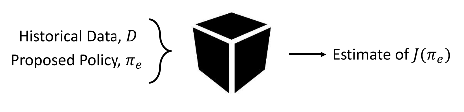
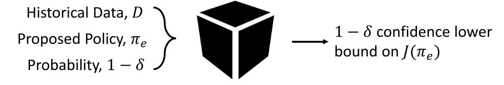
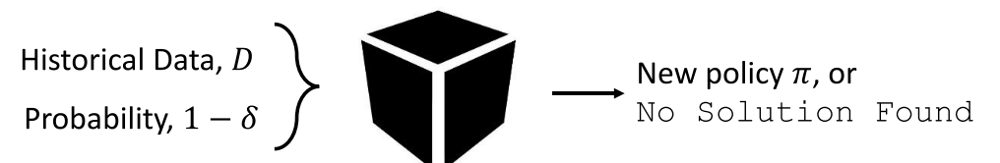

# Safe Reinforcement Learning
## This note is based on the slides of Philip S. Thomas from CMU
### Definition of Safe Reinforcement Learning
1. I guarantee that with probability at least $1-\delta$, I will not change your policy to one that is worse than the current policy.
2. The assumption is restrictive, as well as difficult to uphold in the control case, where the target policy is greedy with respect to the current Q-function. In that sense this algorithm is not safe: it does not handle the case of arbitrary "off-policyness".
3. Guarantee that with probability at least $1-\delta$ the policy (or q-function) will be within $\delta$ of optimal after n episodes.

### Three steps towards a safe algorithm
#### A. Off-Policy Policy Evaluation (OPE)
1. Use a behavior policy produces historical data D;
2. given a new policy $\pi_e$; 
3. predict the performance $J(\pi_e)$ of the evaluation policy; 

#### B. High Confidence Off-Policy Policy Evaluation (HCOPE)
1. Use a behavior policy produces historical data D;
2. given a new policy $\pi_e$; 
3. given a probabilty $1-\delta$;
4. Lower bound the performance $J(\pi_e)$ with probabilty $1-\delta$

#### C. Safe Policy Improvement (SPI)
1. Use a behavior policy produces historical data D;
2. given a probabilty $1-\delta$;
3. Produce a policy $\pi$ that satisfies:
$
P(J(\pi) \geq J(\pi_b)) \geq 1 - \delta
$

# Safe Reinforcement Learning for cyber-physical systems (CPS)
## This paragraph is based on the paper "Safe AI for CPS" by Nathan Fulton from CMU
### Problem
Achieving efficiency, safety, comfort automation of vehiecles required increasing the size and complexity of software. Today's self-driving cars have __become so complex that it is completely infeasible to establish safety by testing.__  
Developers should construct a model of the system under control __then write a formal proof__ that their model satisfies key safety properties.
### Formal satety proofs
#### 1. Verification of model-based controllers
Low-level controllers are designed with respect to a set of differential equations that model the environment. The lowest level of the controls & planning software stack uses the current state to choose actuator inputs.  
Hybrid programs are used to captures the essence of how computation and physics interact in control systems.  

#### 2. VERIFIED MODEL-BASED LOCAL MOTION PLANNING
Differential dynamic logic ($dL$) is a logic for specifying and proving properties of hybrid programs.  
Model-based local motion planning takes as input a high-level (a left-hand turn etc.)but local goal and produces as output a set of inputs to the low-level control software __without violating system safety constraints.__
##### a. Verifiably Safe Reinforcement Learning
Justified Speculative Control (JSC) uses $dL$ safety specifications to obtain safety guarantees for policies obtained via reinforcement learning.  
__JSC uses runtime monitors to constrain the set of available actions.__ If the environmental model is accurate according to a runtime monitor MM for the model, then the learning agent may only select actions that the controller runtime monitor CM designates as proven safe.  
When the model monitor MM is false, we use a quantified version of the original model monitor MM, effectively __rewarding the system for minimizing the error between the model’s prediction of what should have happened and the sensor’s observations of what actually happened.__ This was experimentally observed to have the effect of __driving the agent back into known safe portions of the state space__ quickly.  
JSC uses verified monitors to extend verification results about low-level control software to learned behaviors for achieving high-level but local goals.
##### b. MODEL-BASED BEHAVIORAL DECISION MAKING
The next level up in the autonomous vehicle software stack tackles the problem of choosing and switching between multiple available behavioral models (not local goals).  
The µ-learning algorithm extends formal safety guarantees from the local planning layer to the behavioral layer by combining verified reinforcement learning with online falsification to choose among a set of possible behavioral models.  
Standard µ-learning assumes that a distinguished accurate model $m∗$ already is in the monitored models M. This paper introduced two ways to relax the assumption.  
1. A verification-preserving model up-date (VPMU) is a pair of mappings modelUpdate and proofUpdate which take as input an initial dL formula ϕ with an associated Bellerophon proof e of ϕ, and produce as output a new dL formula modelUpdate(ϕ) and a proof proofUpdate(e) of modelUpdate(ϕ).
2. Consider model updates that are not verification preserving. Switching to an unverified model should only happen as a last resort when there is no available verified model that accurately characterizes observed reality.
### Future Work
1. providing safety and optimality guarantees for continuous state and action spaces
2. providing safety and optimality guarantees outside of model space
3. extending approaches that provide unverified formal constraints with formal mechanized proofs that action constraints are safe with respect to the environmental model
4. incorporating formal guarantees for learning into verified pipelines

